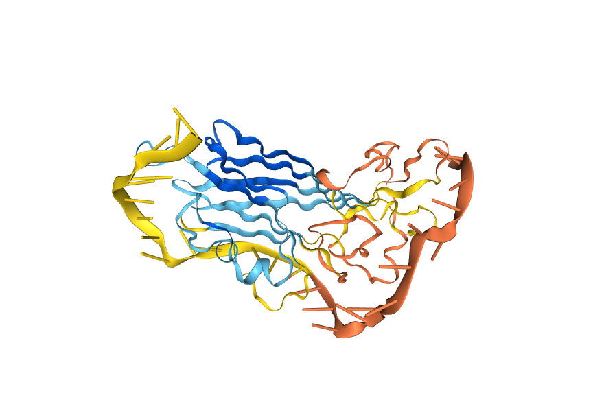
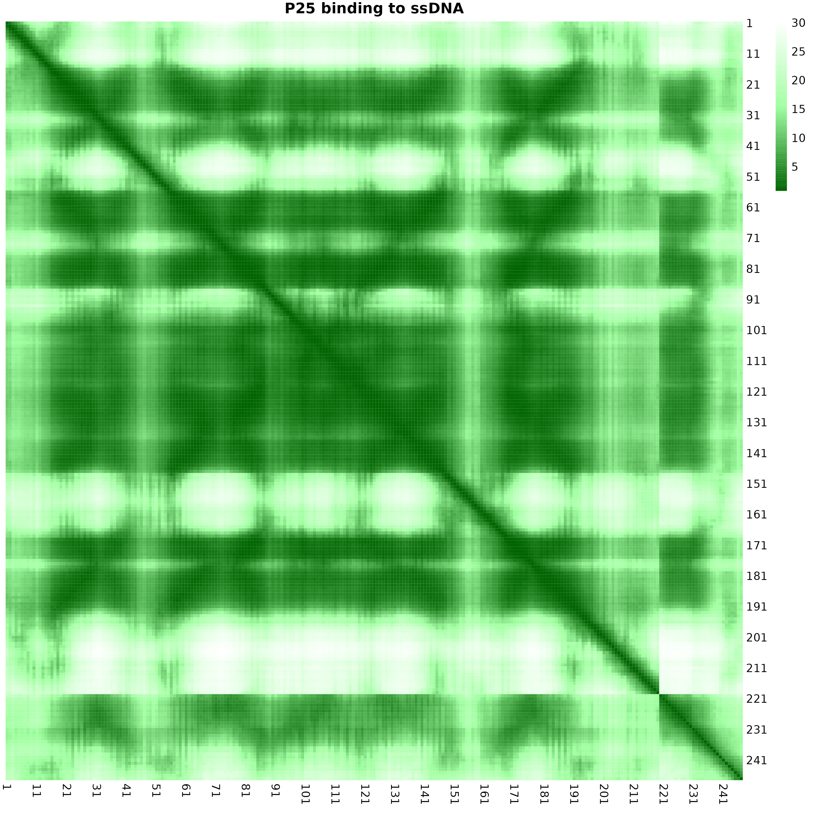
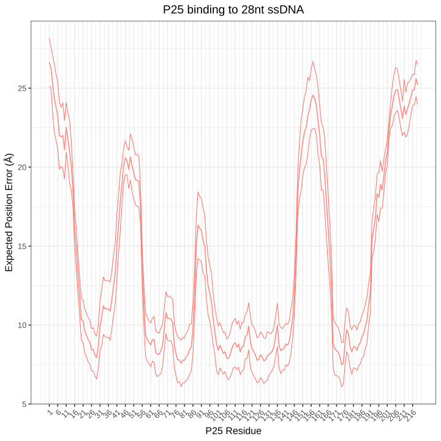
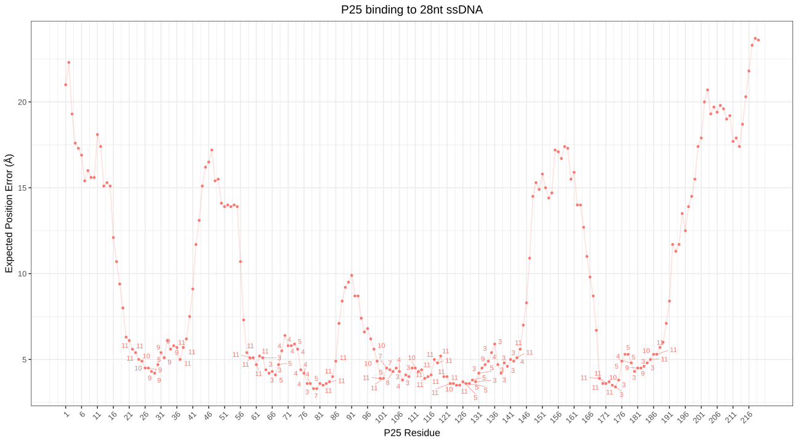
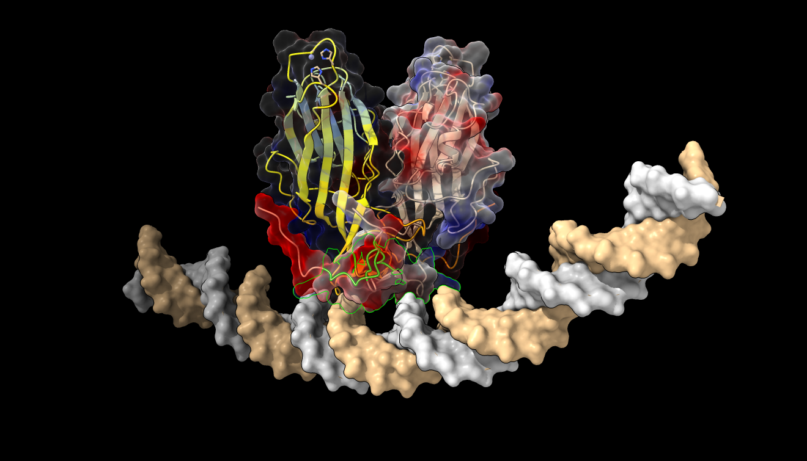
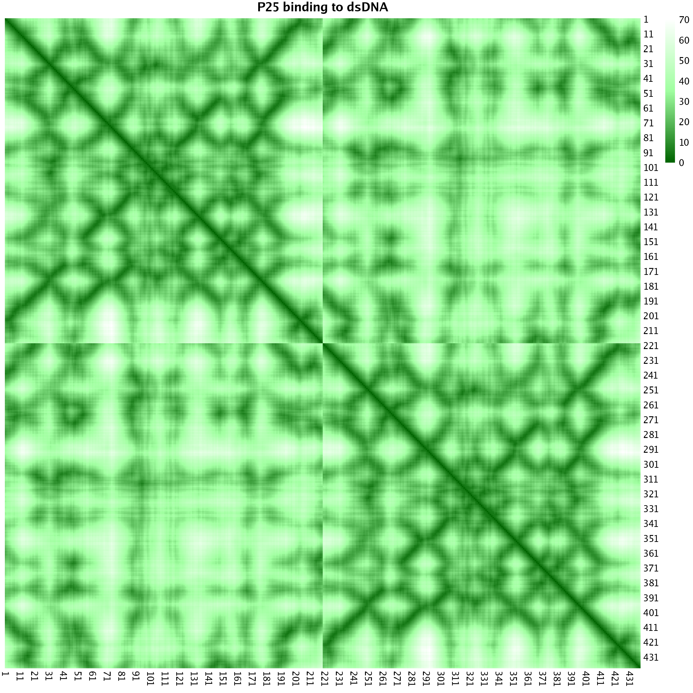

```{r setup, include=FALSE}
knitr::opts_chunk$set(echo = TRUE)
```

```{r,include=FALSE }
library(ggplot2)
library("Biostrings")
library("ggseqlogo")
library(plyr)
library(dplyr)
library(ggrepel)
library(cowplot)
library(reshape2)

process_pae_models_indexing <- function(model_list, row_range, col_range, interaction_name, Type) {
  
  # Initialize an empty list to store data frames
  df_list <- list()
  
  # Loop through each model
  for (i in seq_along(model_list)) {
    model <- model_list[[i]]
    
    # Extract the relevant section of the matrix
    sub_matrix <- model[row_range, col_range]
    
    # Compute minimal PAE per residue and retrieve index
    min_pae <- apply(sub_matrix, 2, min)
    min_index <- apply(sub_matrix, 2, which.min)  # Row index of min PAE
    
    # Adjust indices to reflect the actual row numbers in the full matrix
    min_index_adj <- row_range[min_index]
    
    # Create a data frame
    df <- data.frame(
      Interaction = interaction_name,
      Residue = col_range,  # The residue being evaluated
      MinPAE = min_pae,
      MinPAE_Index = min_index_adj,  # The row index where min PAE was found
      Type = Type,
      Model = as.character(i - 1)  # Assuming models are indexed from 0
    )
    
    # Append to the list
    df_list[[i]] <- df
  }
  
  # Combine all data frames into one
  return(bind_rows(df_list))
}

process_contactP_models_indexing <- function(model_list, row_range, col_range, interaction_name, Type) {
  
  # Initialize an empty list to store data frames
  df_list <- list()
  
  # Loop through each model
  for (i in seq_along(model_list)) {
    model <- model_list[[i]]
    
    # Extract the relevant section of the matrix
    sub_matrix <- model[row_range, col_range]
    
    # Compute minimal PAE per residue and retrieve index
    min_pae <- apply(sub_matrix, 2, max)
    min_index <- apply(sub_matrix, 2, which.max)  # Row index of min PAE
    
    # Adjust indices to reflect the actual row numbers in the full matrix
    min_index_adj <- row_range[min_index]
    
    # Create a data frame
    df <- data.frame(
      Interaction = interaction_name,
      Residue = col_range,  # The residue being evaluated
      MinPAE = min_pae,
      MinPAE_Index = min_index_adj,  # The row index where min PAE was found
      Type = Type,
      Model = as.character(i - 1)  # Assuming models are indexed from 0
    )
    
    # Append to the list
    df_list[[i]] <- df
  }
  
  # Combine all data frames into one
  return(bind_rows(df_list))
}
```

# P25 monomer binding 28ssDNA motif

::: {style="text-align: center;"}
<figure>
```{=html}

```
<figcaption style="margin-top: 10px;">

<strong>P25 binding 28ssDNA motif</strong>

</figcaption>
</figure>
<a name="P25_binding_28ssDNA_structure.png"></a>
:::


```{bash, eval=FALSE}
 bash /home/aiaz0001/Documents/GitHub/ProteinStructure/Codes/ranking.sh
 bash /home/aiaz0001/Documents/GitHub/ProteinStructure/Codes/rmarkdown_format.sh models_ranking.txt
```


| models |	has_clash	|ptm|	iptm|	ranking_score	|num_recycles|	fraction_disordered |
| --- | --- | --- | --- | --- | --- | --- |
| model_0	| 0.0| 	0.72	|0.6	|0.62	|10.0|	0.0 |
| model_1|	0.0|	0.69|	0.42	|0.47|10.0|	0.0 |
| model_2	|0.0|	0.63|	0.39|	0.44|	10.0	|0.01 |
| model_3	|0.0	|0.64|	0.34	|0.42|	10.0	|0.04 |
| model_4	|0.0	|0.63|	0.29|	0.39	|10.0	|0.06 |

## Extracting and Plotting PAE matrix
```{bash, eval=FALSE}
module load Biopython/1.81-foss-2022b 
python3 ../../David/A0A482IHB3_Hexadodecamero/extract_pae_json_global.py fold_2025_02_26_13_25_full_data_0.json P25_binding_28ssDNA_PAE.csv
module load R/4.2.2-foss-2022b 
 Rscript ../../pae_matrix.R P25_binding_28ssDNA_PAE.csv "P25 binding to ssDNA" P25_binding_28ssDNA_PAE.png
```

::: {style="text-align: center;"}
<figure>
```{=html}

```
<figcaption style="margin-top: 10px;">

<strong>PAE matrix of P25 binding 28ssDNA</strong>

</figcaption>
</figure>
<a name="P25_binding_28ssDNA_PAE.png"></a>
:::

## Interaction surface index analysis 

```{r, eval=FALSE}
ViralTFs_BNYVV_P25_0 <- as.matrix(read.csv("/home/aiaz0001/ProteinDisorder/ViralTFs_BNYVV_P25/P25_binding_28ssDNA_PAE.csv", header = FALSE))
ViralTFs_BNYVV_P25_1 <- as.matrix(read.csv("/home/aiaz0001/ProteinDisorder/ViralTFs_BNYVV_P25/P25_binding_28ssDNA_PAE_1.csv", header = FALSE))
ViralTFs_BNYVV_P25_2 <- as.matrix(read.csv("/home/aiaz0001/ProteinDisorder/ViralTFs_BNYVV_P25/P25_binding_28ssDNA_PAE_2.csv", header = FALSE))
ViralTFs_BNYVV_P25_3 <- as.matrix(read.csv("/home/aiaz0001/ProteinDisorder/ViralTFs_BNYVV_P25/P25_binding_28ssDNA_PAE_3.csv", header = FALSE))
ViralTFs_BNYVV_P25_4 <-as.matrix(read.csv("/home/aiaz0001/ProteinDisorder/ViralTFs_BNYVV_P25/P25_binding_28ssDNA_PAE_4.csv", header = FALSE))

model_list <- list(t(ViralTFs_BNYVV_P25_0),t( ViralTFs_BNYVV_P25_1), t(ViralTFs_BNYVV_P25_2), t(ViralTFs_BNYVV_P25_3), t(ViralTFs_BNYVV_P25_4))


ViralTFs_BNYVV_P25_DF <- process_pae_models_indexing(model_list, 220:247, 1:219,"P25 binding to 28nt ssDNA","Unique")
```

```{r,eval=FALSE}
ViralTFs_BNYVV_P25_summary <- ViralTFs_BNYVV_P25_DF %>%
    group_by(Interaction,Residue,Type) %>%
    summarize(
        mean_value = mean(MinPAE),
        sd_value = sd(MinPAE),  # Standard deviation
        n = n(),
        se_value = sd(MinPAE) / sqrt(n())  # Standard error
    )


ViralTFs_BNYVV_P25_summary$Interaction <- as.factor(ViralTFs_BNYVV_P25_summary$Interaction)

length_number <- length(unique(ViralTFs_BNYVV_P25_summary$Residue))

ViralTFs_BNYVV_P25_plot <-   ggplot(ViralTFs_BNYVV_P25_summary, aes(x = Residue, y = mean_value ,  colour =Interaction)) +
      geom_line(size = 0.8, linetype = "solid") +
geom_ribbon(aes(ymin = mean_value - se_value, ymax = mean_value + se_value), alpha = 0.2, fill = "white" ) +
    labs(title = "P25 binding to 28nt ssDNA",
         x = "P25 Residue", y = "Expected Position Error (Å)",
         color = "Interaction") +  theme_bw(base_size = 16)  + #  facet_grid(Interaction~.) + 
  scale_x_continuous(breaks = seq(1, length_number, by = 5)) + 
     theme(axis.text.x = element_text(angle = 45, vjust = 1, hjust=1),plot.title = element_text(hjust = 0.5), legend.position = "none")

 ggsave(filename = "../Figures/ViralTFs_BNYVV_P25_plot.svg", plot = ViralTFs_BNYVV_P25_plot,device = "svg", width=10, height=10)

```

::: {style="text-align: center;"}
<figure>
```{=html}

```
<figcaption style="margin-top: 10px;">

<strong>P25 binding to 28nt ssDNA PAE variation in 5 models</strong>

</figcaption>
</figure>
<a name="ViralTFs_BNYVV_P25_plot.svg"></a>
:::


```{r,eval=FALSE}

ViralTFs_BNYVV_P25_0 <- as.matrix(read.csv("/home/aiaz0001/ProteinDisorder/ViralTFs_BNYVV_P25/P25_binding_28ssDNA_PAE.csv", header = FALSE))

ViralTFs_BNYVV_P25_0_DF <- process_pae_models_indexing(list(t(ViralTFs_BNYVV_P25_0)), 220:247, 1:219,"P25 binding to 28nt ssDNA","Strongest")
ViralTFs_BNYVV_P25_0_DF$Residue <-  row_number(ViralTFs_BNYVV_P25_0_DF)

ViralTFs_BNYVV_P25_0_DF$MinPAE_Index <- ViralTFs_BNYVV_P25_0_DF$MinPAE_Index - 220
ViralTFs_BNYVV_P25_model0 <- ggplot(ViralTFs_BNYVV_P25_0_DF, aes(x = Residue, y = MinPAE ,  colour =Interaction)) +
      geom_line(size = 0.8, linetype = "solid",alpha = 0.2) + geom_point() + 
  geom_text_repel(aes(label =ifelse(MinPAE < 6, MinPAE_Index, NA)), segment.size = 0.3)  + 
   labs(title = "P25 binding to 28nt ssDNA",
         x = "P25 Residue", y = "Expected Position Error (Å)", color = "Interaction") +  theme_bw(base_size = 16)  +
  scale_x_continuous(breaks = seq(min(ViralTFs_BNYVV_P25_0_DF$Residue), max(ViralTFs_BNYVV_P25_0_DF$Residue), by = 5)) +  
  theme(axis.text.x = element_text(angle = 45, vjust = 1, hjust=1),plot.title = element_text(hjust = 0.5), legend.position = "none")

 ggsave(filename = "Figures/ViralTFs_BNYVV_P25_model0_indexed.svg", plot = ViralTFs_BNYVV_P25_model0,device = "svg", width=18, height=10)
```

::: {style="text-align: center;"}
<figure>
```{=html}

```
<figcaption style="margin-top: 10px;">

<strong>Index P25 binding to 28nt ssDNA PAE variation in model 0</strong>

</figcaption>
</figure>
<a name="ViralTFs_BNYVV_P25_model0_indexed.svg"></a>
:::

# P25 dimer binding to dsDNA and Zn2+ ions

## Running with Protenix output 

::: {style="text-align: center;"}
<figure>
```{=html}

```
<figcaption style="margin-top: 10px;">

<strong>P25 dimer binding to 28nt dsDNA and Zn2+ ions, model 4</strong>

</figcaption>
</figure>
<a name="ViralTFs_BNYVV_P25_dsDNA_2Zn_model4.png"></a>
:::

### Etract PAE from CIF (dardel server)

```{bash, eval=FALSE}
module purge
module  load PDCOLD/23.12  biopython/1.84-cpeGNU-23.12

python3 ../../Closeness_and_Angle_Symmetry/Codes/extract_pae_cif.py  BNYVV_P25_P19229_dimer_4Zn_dsDNA_motif_seed_10325_sample_4.cif  BNYVV_P25_P19229_dimer_2Zn_dsDNA_m4.csv


module purge
module  load PDCOLD/23.12 R/4.4.0 

Rscript ../Closeness_and_Angle_Symmetry/Codes/pae_matrix.R ProtenixModels/BNYVV_P25_P19229_dimer_2Zn_dsDNA_m4.csv "P25 binding to dsDNA" P25_binding_28dsDNA_PAE.png
```

::: {style="text-align: center;"}
<figure>
```{=html}

```
<figcaption style="margin-top: 10px;">

<strong>PAE matrix P25 dimer binding to 28nt dsDNA, model 4</strong>

</figcaption>
</figure>
<a name="P25_binding_28dsDNA_PAE.png"></a>
:::

## Running Protenix with PAE output 
```{bash, eval=FALSE}
git clone https://github.com/Bytedance/Protenix.git
cd Protenix

# Edit in the  configs_inference.py file, the field "need_atom_confidence": from "False," to "True,"
vim /home/aiaz0001/.local/lib/python3.10/site-packages/configs/configs_inference.py 

# Install with the configuration change 
pip install -e . --user

#  Write input json file following examples with or without pre caluclated msa info 

# Evaluate input json correct formating with : 
python3 -m json.tool P6dimers_TOR/P6dimers_TOR.json > P6dimers_TOR/P6dimers_TOR_cor.json

protenix predict --input input_without_msa.json --out_dir  LocalRunPAE/ --use_msa_server  --seeds 93187 
```

Protenix first pre-computes msa, changing the input file from `input_without_msa.json`  to `input_without_msa-add-msa.json` and the generates now a json file called full_data together to summary_confidence json files 

::: {style="text-align: center;"}
<figure>
```{=html}

```
<figcaption style="margin-top: 10px;">

<strong>Contact probability of P25 dimer binding to 2 Zn²⁺ions and 93bp dsDNA, model 1</strong>

</figcaption>
</figure>
<a name="Protenix_BNYVV_P25_P19229_dimer_2Zn_dsDNA_cprob_m1.png"></a>
:::

#### Model statistics 
```{bash, eval=FALSE}
bash ranking.sh
bash rmarkdown_format.sh models_ranking_local.txt
```

| models| disorder  |	iptm  |	ptm  |	plddt  |	ranking_score  |	gpde |
| --- | --- | --- | --- | --- | --- | --- |
| model_0 |0.0 |	0.187	 |0.328 |	61.478 |	0.215 |	1.918 |
| model_1	 |0.0	 |0.172	 |0.329 |	62.364 |	0.203 |	1.931|
| model_2	 |0.0	 |0.166 |	0.329 |	61.060 |	0.198 |	1.99 |
| model_3	 |0.0	 |0.162 |	0.328 |	60.658 |	0.196 |	1.979 |
| model_4 |	0.0 |	0.157 |	0.327 |	61.877 | 0.191 |	1.992 |

::: {style="text-align: center;"}
<figure>
```{=html}

```
<figcaption style="margin-top: 10px;">

<strong>Top model (m0) for P25 dimer binding to 2 Zn²⁺ ions and 93bp dsDNA</strong>

</figcaption>
</figure>
<a name="M0_P25_dsDNA_2Zn.png"></a>
:::
  
### Setting it on in Dardel server 

[Dardel server support GPU computing but restricted to AMD processors](https://www.pdc.kth.se/hpc-services/computing-systems/about-the-dardel-system-1.1053338), which seems to be inappropriate for Protenix (built for NVIDIA CUDA (not ROCm)), however I did follow the same instructions for installation, plus two important additional steps: 

1. The possibility of running with [GPU support](https://support.pdc.kth.se/doc/applications/pytorch/)
2. Configuring PATH and PYTHONPATH variables for running in n node of dardel system

```{bash, eval=FALSE}
salloc --nodes=1 -t 12:00:00 -A  naiss2025-22-364 -p gpu 
#-p main for CPU only
module load bioinfo-tools
module load python/3.10.8
ml add PDC
ml add singularity/4.2.0-cpeGNU-24.11 

# After installing it, set paths 
export PYTHONPATH=/cfs/klemming/home/a/aimerdi/.local/lib/python3.10/site-packages/:$PYTHONPATH
echo  $PYTHONPATH
echo 'export PATH=$HOME/.local/bin:$PATH' >> ~/.bashrc 
# Panda was not install there, how did I check 
python -m pip list | grep pandas
python -c "import pandas; print(pandas.__file__)"
python3 -c "import pandas; print(pandas.__version__)"


# Enter to the singularity shell 
singularity shell --rocm -B /cfs/klemming /pdc/software/resources/sing_hub/rocm5.7_ubuntu22.04_py3.10_pytorch_2.0.1 
pip install pandas 
pip install ipywidgets

# Test presence of GPU and all Python codes required to run in it
python -c "import torch; print(torch.cuda.is_available())"

# Precomputing MSA 
protenix msa --input P6dimers_TOR/P6dimers_TORc.json --out_dir P6dimers_TOR/
```

The execution was not using protenix command but editing inference script `inference_demo.sh` as shown :
```{bash, eval=FALSE}
export LAYERNORM_TYPE=layernorm

N_sample=5
N_step=200
N_cycle=10
seed="$3"

input_json_path="$1"
dump_dir="$2"

echo ${seed} ${dump_dir} ${input_json_path}
python3 runner/inference.py \
--seeds ${seed} \
--dump_dir ${dump_dir} \
--input_json_path ${input_json_path} \
--model.N_cycle ${N_cycle} \
--sample_diffusion.N_sample ${N_sample} \
--sample_diffusion.N_step ${N_step} \
--need_atom_confidence true
```

Which should be run as follow : 
```{bash, eval=FALSE}
singularity exec --rocm -B /cfs/klemming /pdc/software/resources/sing_hub/rocm5.7_ubuntu22.04_py3.10_pytorch_2.0.1  bash inference_parameter.sh P6dimers_TOR/P6dimers_TORc-add-msa.json P6dimers_TOR/ 88467 
```

### Slurm script 

Or directly as an slurm script : 

```{bash, eval=FALSE}
#!/bin/bash -l
#SBATCH -A naiss2025-22-364
#SBATCH -J Protenix
#SBATCH -p gpu
#SBATCH -t 12:00:00
#SBATCH --mem=128GB
#SBATCH --cpus-per-task=10
#SBATCH --gres=gpu:2
#SBATCH -o Protenix-%x.%j.log
#SBATCH --error=Protenix-%x.%j.err
#SBATCH --mail-type=ALL
#SBATCH --mail-user=aimerdiaz.evo@gmail.com

module load bioinfo-tools
module load python/3.10.8
ml add PDC
ml add singularity/4.2.0-cpeGNU-24.11

echo $HOSTNAME
# These variables are now set by the module
timestamp=$(date)
echo "Starting Protenix at $timestamp"

cd /cfs/klemming/projects/snic/naiss2023-23-555/Protenix/

#singularity exec --rocm -B /cfs/klemming /pdc/software/resources/sing_hub/rocm5.7_ubuntu22.04_py3.10_pytorch_2.0.1  bash inference_parameter.sh P6_dimer_dsRNA/P6_dimer_dsRNA-add-msa.json P6
_dimer_dsRNA/ 95890 
singularity exec --rocm -B /cfs/klemming /pdc/software/resources/sing_hub/rocm5.7_ubuntu22.04_py3.10_pytorch_2.0.1  bash inference_parameter.sh P6dimers_TOR/P6dimers_TORc-add-msa.json  P6dim
ers_TOR/ 88467
echo INFO: Protenix returned $?

timestamp=$(date)
echo "Finishing Protenix at $timestamp"

#https://www.kth.se/blogs/pdc/2018/08/getting-started-with-slurm/ 
```

### Extracting PAE, PDE and contact propabilities 

```{bash, eval=FALSE}
grep -oP   "\"\w+\":"  LocalRunPAE/Protenix_BNYVV_P25_P19229_dimer_2Zn_dsDNA/seed_93187/predictions/Protenix_BNYVV_P25_P19229_dimer_2Zn_dsDNA_full_data_sample_0.json 
"atom_plddt":
"token_pair_pde":
"token_pair_pae":
"contact_probs":
"token_has_frame":
"token_asym_id":
"atom_to_token_idx":
```

The "contact_probs" is a matrix of predicted contact probabilities between residue pairs (or tokens). Values range from 0 to 1 — high values suggest a physical proximity or interaction between residues/tokens. Useful for predicting binding sites or domain interfaces.

```{bash, eval=FALSE}
 perl extract_pae_pde_contactprob_protenix.pl /home/aiaz0001/ProteinDisorder/ViralTFs_BNYVV_P25/Protenix_BNYVV_P25_P19229_dimer_2Zn_ssDNA/LocalRunPAE/Protenix_BNYVV_P25_P19229_dimer_2Zn_dsDNA/seed_93187/predictions/Protenix_BNYVV_P25_P19229_dimer_2Zn_dsDNA_full_data_sample_1.json contact_probs  Protenix_BNYVV_P25_P19229_dimer_2Zn_dsDNA_contactProb_m1.csv 
 
 Rscript pae_matrix.R Protenix_BNYVV_P25_P19229_dimer_2Zn_dsDNA_pae_m1.csv "PAE BNYVV_P25 dimer, 2Zn binding to dsDNA" Protenix_BNYVV_P25_P19229_dimer_2Zn_dsDNA_pae_m1.png
```

::: {style="text-align: center;"}
<figure>
```{=html}

```
<figcaption style="margin-top: 10px;">

<strong>Protenix PAE of P25 dimer binding to 2 Zn²⁺ ions and 93bp dsDNA, model 1</strong>

</figcaption>
</figure>
<a name="Protenix_BNYVV_P25_P19229_dimer_2Zn_dsDNA_pae_m1.png"></a>
:::

```{bash, eval=FALSE}
for f in *full_data_sample_*.json ; do name=`basename -s ".json" $f`; echo $name ; perl ~/Documents/GitHub/Complex_Geometry/Codes/extract_pae_pde_contactprob_protenix.pl token_pair_pae, $f $name"_pae.csv" ; done 
```


```{r, eval=FALSE}
P25_dsDNA_0 <- as.matrix(read.csv("ProtenixModels/Protenix_BNYVV_P25_P19229_dimer_2Zn_dsDNA_full_data_sample_0_pae.csv.gz", header = FALSE))
P25_dsDNA_1 <- as.matrix(read.csv("ProtenixModels/Protenix_BNYVV_P25_P19229_dimer_2Zn_dsDNA_full_data_sample_1_pae.csv.gz", header = FALSE))
P25_dsDNA_2 <- as.matrix(read.csv("ProtenixModels/Protenix_BNYVV_P25_P19229_dimer_2Zn_dsDNA_full_data_sample_2_pae.csv.gz", header = FALSE))
P25_dsDNA_3 <- as.matrix(read.csv("ProtenixModels/Protenix_BNYVV_P25_P19229_dimer_2Zn_dsDNA_full_data_sample_3_pae.csv.gz", header = FALSE))
P25_dsDNA_4 <- as.matrix(read.csv("ProtenixModels/Protenix_BNYVV_P25_P19229_dimer_2Zn_dsDNA_full_data_sample_4_pae.csv.gz", header = FALSE))

model_list <- list(t(P25_dsDNA_0),t( P25_dsDNA_1), t(P25_dsDNA_2), t(P25_dsDNA_3), t(P25_dsDNA_4))

P25_dimer_pae <- process_pae_models_indexing(model_list, 1:219, 220:438,"P25A binding to P25B","Medium")
P25_dimer_pae$Residue <- P25_dimer_pae$Residue - 219 

P25A_dimer_pae <- process_pae_models_indexing(model_list, 533:624,220:438,"P25A binding to 93bp dsDNA","Weak")
P25A_dimer_pae$Residue <- P25A_dimer_pae$Residue - 219
P25A_dimer_pae$MinPAE_Index <- P25A_dimer_pae$MinPAE_Index - 532

P25B_dimer_pae <- process_pae_models_indexing(model_list, 533:624,1:219,"P25B binding to 93bp dsDNA","Weak")
P25B_dimer_pae$MinPAE_Index <- P25B_dimer_pae$MinPAE_Index - 532

P25_Zn_CP_pae <- process_pae_models_indexing(model_list, 624:626,1:219,"P25A binding to 2Zn","Strong")
P25_Zn_CP_pae$MinPAE_Index <- P25_Zn_CP_pae$MinPAE_Index - 624

P25Ad_dsDNA_DF_ALL <-  rbind.data.frame(P25_dimer_pae,P25A_dimer_pae,P25B_dimer_pae,P25_Zn_CP_pae)

P25Ad_dsDNA_DF_summary <- P25Ad_dsDNA_DF_ALL %>%
    group_by(Interaction,Residue,Type) %>%
    summarize(
        mean_value = mean(MinPAE),
        sd_value = sd(MinPAE),  # Standard deviation
        n = n(),
        se_value = sd(MinPAE) / sqrt(n())  # Standard error
    )

P25Ad_dsDNA_DF_summary$Interaction<- factor(P25Ad_dsDNA_DF_summary$Interaction, levels = c("P25A binding to P25B",
                                                                               "P25A binding to 93bp dsDNA",
                                                                               "P25B binding to 93bp dsDNA", 
                                                                               "P25A binding to 2Zn"))

P25d_dsDNA_all_plot <-  ggplot(P25Ad_dsDNA_DF_summary, aes(x = Residue, y = mean_value ,  colour =Interaction)) +
           scale_colour_viridis_d(-1)  +   geom_line(size = 0.8, linetype = "solid") +
geom_ribbon(aes(ymin = mean_value - se_value, ymax = mean_value + se_value), alpha = 0.2, colour = NA ) +
    labs(title = "PAE P25 dimer binding to dsDNA",
         x = "P25 Residue", y = "Expected Position Error (Å)",
         color = "Interaction") +  theme_classic(base_size = 16)  +
  scale_x_continuous(breaks = seq(1, length(P25Ad_dsDNA_DF_summary$Residue), by = 5)) + 
     theme(axis.text.x = element_text(angle = 45, vjust = 1, hjust=1),plot.title = element_text(hjust = 0.5),legend.position = "bottom") +
  facet_grid(Interaction~., scales = "free")  

  ggsave(filename = "../Figures/ViralTFs_BNYVV_P25_pae_plot.svg", plot = P25d_dsDNA_all_plot,device = "svg", width=12, height=12)

```
::: {style="text-align: center;"}
<figure>
```{=html}

```
<figcaption style="margin-top: 10px;">

<strong>Linear PAE of P25 dimer binding to 2 Zn²⁺ ions and 93bp dsDNA, model 1</strong>

</figcaption>
</figure>
<a name="ViralTFs_BNYVV_P25_pae_plot.svg"></a>
:::


### Contact probability in interaction surface

```{bash, eval=FALSE}
Rscript contact_prob.R Protenix_BNYVV_P25_P19229_dimer_2Zn_dsDNA_contactProb_m0.csv "BNYVV_P25 dimer, 2Zn binding to dsDNA m0 (contact prob)" Protenix_BNYVV_P25_P19229_dimer_2Zn_dsDNA_cprob_m0.png
```

::: {style="text-align: center;"}
<figure>
```{=html}

```
<figcaption style="margin-top: 10px;">

<strong>Protenix Contact  probabilitie of P25 dimer binding to 2 Zn²⁺ ions and 93bp dsDNA, model 1</strong>

</figcaption>
</figure>
<a name="Protenix_BNYVV_P25_P19229_dimer_2Zn_dsDNA_cprob_m0.png"></a>
:::


```{r, eval=FALSE}
 colnames_seq <- paste0( "MGDILGAVYDLGHRPYLARRTVYEDRLILSTHGNICRAINLLTHDNRTTLVYHNNTKRIRFRGLLCALHGPYCGFRALCRVMLCSLPRLCDIPINGSRDFVADPTRLDSSVNELLVSNGLVIHYDRVHHVPLHTDGFEVVDFTTVFRGPGNFLLPNATNFPRPTTTDQVYMVCLVNTVNCVLRFESELTVWVHSGLYTGDVLDVDNNVIQAPDGVDDDG","MGDILGAVYDLGHRPYLARRTVYEDRLILSTHGNICRAINLLTHDNRTTLVYHNNTKRIRFRGLLCALHGPYCGFRALCRVMLCSLPRLCDIPINGSRDFVADPTRLDSSVNELLVSNGLVIHYDRVHHVPLHTDGFEVVDFTTVFRGPGNFLLPNATNFPRPTTTDQVYMVCLVNTVNCVLRFESELTVWVHSGLYTGDVLDVDNNVIQAPDGVDDDG", "TTCGTGGCCGGAAAGAGGCAAAAGAAGACTAGCTTACACCTCATGGGGGTCAAGCAAGAGAAGAATGAAAGTCTAGCCGACTACATAAAAAGA", 
"TCTTTTTATGTAGTCGGCTAGACTTTCATTCTTCTCTTGCTTGACCCCCATGAGGTGTAAGCTAGTCTTCTTTTGCCTCTTTCCGGCCACGAA", 
"Z","Z", collapse = "") 
nt_seq <- paste0( "TTCGTGGCCGGAAAGAGGCAAAAGAAGACTAGCTTACACCTCATGGGGGTCAAGCAAGAGAAGAATGAAAGTCTAGCCGACTACATAAAAAGA", 
"TCTTTTTATGTAGTCGGCTAGACTTTCATTCTTCTCTTGCTTGACCCCCATGAGGTGTAAGCTAGTCTTCTTTTGCCTCTTTCCGGCCACGAA", 
"Z","Z", collapse = "") 
colsplit <- strsplit(colnames_seq, "")[[1]]
colsplit_nt_seq <- strsplit(nt_seq, "")[[1]]


colsplit_number <- paste0(seq(1,626), colsplit, sep="")
colsplit_nt_seq_number <- paste0(seq(1,188), colsplit_nt_seq, sep="")

P25_dimer_2Zn_dsDNA_1  <- as.matrix(read.csv("ProtenixModels/Protenix_BNYVV_P25_P19229_dimer_2Zn_dsDNA_contactProb_m1.csv", header = FALSE))
model_list <- list(t(P25_dimer_2Zn_dsDNA_1))

#BNYVV_P25A_dsDNA_CP <- process_contactP_models_indexing(model_list, 439:532,1:219,"P25A binding to 93bp dsDNA","Unique")
BNYVV_P25A_dsDNA_CP <- process_contactP_models_indexing(model_list, 439:624,1:219,"P25A binding to 93bp dsDNA","Unique")
BNYVV_P25A_dsDNA_CP$ResidueName <- colsplit_number[BNYVV_P25A_dsDNA_CP$Residue]
BNYVV_P25A_dsDNA_CP$MinPAE_Index <- BNYVV_P25A_dsDNA_CP$MinPAE_Index - 438
BNYVV_P25A_dsDNA_CP$InterName <- colsplit_nt_seq_number[BNYVV_P25A_dsDNA_CP$MinPAE_Index]


BNYVV_P25B_dsDNA_CP <- process_contactP_models_indexing(model_list, 439:624,220:438,"P25B binding to 93bp dsDNA","Unique")
BNYVV_P25B_dsDNA_CP$Residue <- BNYVV_P25B_dsDNA_CP$Residue - 219
BNYVV_P25B_dsDNA_CP$ResidueName <- colsplit_number[BNYVV_P25B_dsDNA_CP$Residue]
BNYVV_P25B_dsDNA_CP$MinPAE_Index <- BNYVV_P25B_dsDNA_CP$MinPAE_Index - 438
BNYVV_P25B_dsDNA_CP$InterName <- colsplit_nt_seq_number[BNYVV_P25B_dsDNA_CP$MinPAE_Index]


BNYVV_P25_dimer_CP <- process_contactP_models_indexing(model_list, 1:219, 220:439,"P25A binding to P25B","Unique")

BNYVV_P25_dimer_CP$ResidueName <- colsplit_number[BNYVV_P25_dimer_CP$Residue]
BNYVV_P25_dimer_CP$InterName <- colsplit_number[BNYVV_P25_dimer_CP$MinPAE_Index]
BNYVV_P25_dimer_CP$Residue  <- BNYVV_P25_dimer_CP$Residue - 219


BNYVV_P25_Zn_CP <- process_contactP_models_indexing(model_list, 625:626,1:219,"P25A binding to 2Zn","Unique")
BNYVV_P25_Zn_CP$InterName <- colsplit_number[BNYVV_P25_Zn_CP$MinPAE_Index]
BNYVV_P25_Zn_CP$ResidueName <- colsplit_number[BNYVV_P25_Zn_CP$Residue]


BNYVV_P25d_dsDNA  <-  rbind.data.frame(BNYVV_P25A_dsDNA_CP,BNYVV_P25B_dsDNA_CP, BNYVV_P25_dimer_CP,BNYVV_P25_Zn_CP)

highlight_residues <- BNYVV_P25d_dsDNA[BNYVV_P25d_dsDNA$MinPAE >= 0.07,2] 

BNYVV_P25d_dsDNA$Interaction<- factor(BNYVV_P25d_dsDNA$Interaction, levels = c("P25A binding to P25B",
                                                                               "P25A binding to 93bp dsDNA",
                                                                               "P25B binding to 93bp dsDNA", 
                                                                               "P25A binding to 2Zn"))
BNYVV_P25d_dsDNA_plot <- ggplot(BNYVV_P25d_dsDNA[BNYVV_P25d_dsDNA$MinPAE > 0,], aes(x = Residue, y = MinPAE ,  fill =Interaction)) +
     #scale_color_manual(values = colors) + 
      scale_fill_viridis_d(-1)  +  
  #geom_line(size = 0.8, linetype = "solid") +
 geom_col() + 
    geom_text_repel(aes(label =ifelse(MinPAE < 0.4 & MinPAE > 0.05 , InterName , NA)), # index < 25 for P6B
                  segment.size = 0.3)  + 
    labs(title = "Contact probabilities P25 dimer binding to dsDNA and  2Zn²⁺\nfor top model",
         x = "P25 Residue", y = "Contact probabilities",
         color = "Interaction") +  theme_classic(base_size = 16)  +
  #scale_x_continuous(breaks = seq(1, length(P6dimmer$Residue), by = 5)) + 
     theme(axis.text.x = element_text(angle = 45, vjust = 1, hjust=1),plot.title = element_text(hjust = 0.5),legend.position = "bottom") + 
     facet_grid(Interaction~., scales = "free_y")  +
  #scale_y_continuous(breaks = seq(0, 1, by = 0.02))  +
  # keep defaults and add highlight_residues as extra breaks
  scale_x_continuous(breaks = function(x) {
    unique(c(pretty(x), highlight_residues))
  })          

 ggsave(filename = "../Figures/ViralTFs_BNYVV_P25_CP_plot.svg", plot = BNYVV_P25d_dsDNA_plot,device = "svg", width=18, height=12)
```

::: {style="text-align: center;"}
<figure>
```{=html}

```
<figcaption style="margin-top: 10px;">

<strong>Linear Contact probabilities of P25 dimer binding to 2 Zn²⁺ ions and 93bp dsDNA, model 1</strong>

</figcaption>
</figure>
<a name="ViralTFs_BNYVV_P25_CP_plot.svg"></a>
:::

#### Contact probabilities dsDNA to P25

```{r, eval=FALSE}

  colnames_seq <- paste0( "MGDILGAVYDLGHRPYLARRTVYEDRLILSTHGNICRAINLLTHDNRTTLVYHNNTKRIRFRGLLCALHGPYCGFRALCRVMLCSLPRLCDIPINGSRDFVADPTRLDSSVNELLVSNGLVIHYDRVHHVPLHTDGFEVVDFTTVFRGPGNFLLPNATNFPRPTTTDQVYMVCLVNTVNCVLRFESELTVWVHSGLYTGDVLDVDNNVIQAPDGVDDDG","MGDILGAVYDLGHRPYLARRTVYEDRLILSTHGNICRAINLLTHDNRTTLVYHNNTKRIRFRGLLCALHGPYCGFRALCRVMLCSLPRLCDIPINGSRDFVADPTRLDSSVNELLVSNGLVIHYDRVHHVPLHTDGFEVVDFTTVFRGPGNFLLPNATNFPRPTTTDQVYMVCLVNTVNCVLRFESELTVWVHSGLYTGDVLDVDNNVIQAPDGVDDDG", "TTCGTGGCCGGAAAGAGGCAAAAGAAGACTAGCTTACACCTCATGGGGGTCAAGCAAGAGAAGAATGAAAGTCTAGCCGACTACATAAAAAGA", 
"TCTTTTTATGTAGTCGGCTAGACTTTCATTCTTCTCTTGCTTGACCCCCATGAGGTGTAAGCTAGTCTTCTTTTGCCTCTTTCCGGCCACGAA", 
"Z","Z", collapse = "") 
colsplit <- strsplit(colnames_seq, "")[[1]]
colsplit_number <- paste0(seq(1,626), colsplit, sep="")

P25_dimer_2Zn_dsDNA_1 <- as.matrix(read.csv("ProtenixModels/Protenix_BNYVV_P25_P19229_dimer_2Zn_dsDNA_contactProb_m1.csv", header = FALSE))

model_list <- list(t(P25_dimer_2Zn_dsDNA_1))


#BNYVV_P25A_dsDNA_CP <- process_contactP_models_indexing(model_list, 439:532,1:219,"P25A binding to 93bp dsDNA","Unique")
BNYVV_P25A_dsDNA_CP_neg <- process_contactP_models_indexing(model_list, 1:219,532:624,"93nt - dsDNA binding to P25A","Negative strand")
BNYVV_P25A_dsDNA_CP_neg$ResidueName <- colsplit_number[BNYVV_P25A_dsDNA_CP_neg$Residue]
BNYVV_P25A_dsDNA_CP_neg$InterName <- colsplit_number[BNYVV_P25A_dsDNA_CP_neg$MinPAE_Index]
BNYVV_P25A_dsDNA_CP_neg$Residue <- BNYVV_P25A_dsDNA_CP_neg$Residue - 531
 
BNYVV_P25A_dsDNA_CP_pos <- process_contactP_models_indexing(model_list, 1:219,439:531,"93nt + dsDNA binding to P25A","Positive strand")
BNYVV_P25A_dsDNA_CP_pos$ResidueName <- colsplit_number[BNYVV_P25A_dsDNA_CP_pos$Residue]
BNYVV_P25A_dsDNA_CP_pos$InterName <- colsplit_number[BNYVV_P25A_dsDNA_CP_pos$MinPAE_Index]
BNYVV_P25A_dsDNA_CP_pos$Residue <- BNYVV_P25A_dsDNA_CP_pos$Residue - 438

BNYVV_P25B_dsDNA_CP_neg  <- process_contactP_models_indexing(model_list, 220:438,532:624,"93nt - dsDNA binding to P25B","Negative strand")
BNYVV_P25B_dsDNA_CP_neg$ResidueName <- colsplit_number[BNYVV_P25B_dsDNA_CP_neg$Residue]
BNYVV_P25B_dsDNA_CP_neg$Residue <- BNYVV_P25B_dsDNA_CP_neg$Residue - 531
BNYVV_P25B_dsDNA_CP_neg$MinPAE_Index <- BNYVV_P25B_dsDNA_CP_neg$MinPAE_Index - 219
BNYVV_P25B_dsDNA_CP_neg$InterName <- colsplit_number[BNYVV_P25B_dsDNA_CP_neg$MinPAE_Index]

BNYVV_P25B_dsDNA_CP_pos <- process_contactP_models_indexing(model_list, 220:438,439:531,"93nt + dsDNA binding to P25B","Positive strand")
BNYVV_P25B_dsDNA_CP_pos$ResidueName <- colsplit_number[BNYVV_P25B_dsDNA_CP_pos$Residue]
BNYVV_P25B_dsDNA_CP_pos$Residue <- BNYVV_P25B_dsDNA_CP_pos$Residue - 438
BNYVV_P25B_dsDNA_CP_pos$MinPAE_Index <- BNYVV_P25B_dsDNA_CP_pos$MinPAE_Index - 219
BNYVV_P25B_dsDNA_CP_pos$InterName <- colsplit_number[BNYVV_P25B_dsDNA_CP_pos$MinPAE_Index]

BNYVV_P25d_dsDNA  <-  rbind.data.frame(BNYVV_P25A_dsDNA_CP_pos,BNYVV_P25A_dsDNA_CP_neg, BNYVV_P25B_dsDNA_CP_pos, BNYVV_P25B_dsDNA_CP_neg)

highlight_residues <- BNYVV_P25d_dsDNA[BNYVV_P25d_dsDNA$MinPAE >= 0.05,2] 

BNYVV_P25d_dsDNA$Interaction<- factor(BNYVV_P25d_dsDNA$Interaction, levels = c("93nt + dsDNA binding to P25A",
                                                                               "93nt - dsDNA binding to P25A",
                                                                               "93nt + dsDNA binding to P25B",
                                                                               "93nt - dsDNA binding to P25B"))

BNYVV_P25d_dsDNA_plot <- ggplot(BNYVV_P25d_dsDNA[BNYVV_P25d_dsDNA$MinPAE>0,], aes(x = Residue, y = MinPAE ,  fill =Interaction)) +
     #scale_color_manual(values = colors) + 
      scale_fill_viridis_d(-1)  +  
  geom_col() +
 geom_point() + 
    geom_text_repel(aes(label =ifelse( MinPAE > 0.01 , InterName , NA)), # index < 25 for P6B
                  segment.size = 0.3)  + 
    labs(title = "Contact probabilities dsDNA binding to P25 dimer",
         x = "dsDNA nucleotide", y = "Contact probabilities",
         color = "Interaction") +  theme_classic(base_size = 16)  +
     theme(axis.text.x = element_text(angle = 45, vjust = 1, hjust=1),plot.title = element_text(hjust = 0.5),legend.position = "bottom") +
  # keep defaults and add highlight_residues as extra breaks
  scale_x_continuous(breaks = function(x) {
    unique(c(pretty(x), highlight_residues))
  })          +  scale_y_continuous(breaks = seq(0, 1, by = 0.01))  +
  facet_grid(Interaction~., scales = "free_y")  
 ggsave(filename = "../Figures/ViralTFs_dsDNA_to_BNYVV_P25_CP_plot.svg", plot = BNYVV_P25d_dsDNA_plot,device = "svg", width=18, height=12)
 
 write.csv(BNYVV_P25d_dsDNA[BNYVV_P25d_dsDNA$MinPAE >= 0.03,] , file =  "Results/ViralTFs_dsDNA_to_BNYVV_P25_CP.txt",  row.names =F ) 
 
```

::: {style="text-align: center;"}
<figure>
```{=html}

```
<figcaption style="margin-top: 10px;">

<strong>Linear Contact probabilities of dsRNA binding P25 dimer, model 1</strong>

</figcaption>
</figure>
<a name="ViralTFs_dsDNA_to_BNYVV_P25_CP_plot.svg"></a>
:::

## Displaying physical distances  

PAE do not encode the actual physical distance between the set of modeled molecules, in order to do so a [phyton script implementation](Codes/intermodel_chain_distances_from_cif.py) was developed which calculate the minimum distance per residue using representative atoms, for Protein CA and for Nucleic acids, P. 

```{bash, eval=FALSE}
 python3 intermodel_chain_distances_from_cif.py --in Protenix_BNYVV_P25_Local_dimer_2Zn_dsDNA_seed_93187_sample_0.cif --out P25_Local_dimer_2Zn_dsDNA_distancefromcif.txt
 
#Usage examples:
# Residue-level minimal distances between chains across two files
# python intermodel_chain_distances_from_cif.py --in a.cif b.cif --mode res --out res_min.csv

# Atom-level contacts within 5 Å across all chains and files, only inter-file
# python intermodel_chain_distances_from_cif.py --in a.cif b.cif --mode atom --cutoff 5.0 --distinct-models true --out atom_contacts_5A.csv

# Allow chains inside the same file/object as long as chain IDs differ 
# python intermodel_chain_distances_from_cif.py --in complex.cif --mode res --distinct-models false --out within_object_res_min.csv
```

```{r}
P25_dimer_2Zn_dsDNA_cif_distance <- read.csv("ProtenixModels/P25_Local_dimer_2Zn_dsDNA_distancefromcif.txt", header = T)

#P25_dimer_2Zn_dsDNA_distances <- P25_dimer_2Zn_dsDNA_cif_distance[P25_dimer_2Zn_dsDNA_cif_distance$distance_A < 10, ]
P25_dimer_2Zn_dsDNA_cif_distance$model1 <- gsub(".*\\|","",P25_dimer_2Zn_dsDNA_cif_distance$model1)
P25_dimer_2Zn_dsDNA_cif_distance$model2 <- gsub(".*\\|","",P25_dimer_2Zn_dsDNA_cif_distance$model2)

P25_dimer_2Zn_dsDNA_cif_distance[P25_dimer_2Zn_dsDNA_cif_distance$resi1 == 161,]

write.csv(P25_dimer_2Zn_dsDNA_cif_distance , file =  "Results/P25_dimer_2Zn_dsDNA_distances.txt",  row.names =F ) 


Zn_Role <- P25_dimer_2Zn_dsDNA_cif_distance[( P25_dimer_2Zn_dsDNA_cif_distance$chain2 == "E" | P25_dimer_2Zn_dsDNA_cif_distance$chain2 == "F") , ]
```
To verify distance calculation, the model was loaded on ChimeraX, using the following commands: 

```{bash, eval=FALSE}
# https://www.rbvi.ucsf.edu/chimerax/docs/user/tutorials/binding-sites.html

split #1
distance #1.2/b:161@CA #1.3/c:35@P 
distance #1.2/b:161@N #1.3/c:35@P 

# To show all distances 
contacts #1.1/a:161 #1.3/c:56 reveal t showdist t;  label height 1; 

# To filter only inter Model distances 
contacts #1.1/a:161 #1.3/c:56 reveal t showdist t intraMol false;  label height 1; 
```


::: {style="text-align: center;"}
<figure>
```{=html}

```
<figcaption style="margin-top: 10px;">

<strong>Distance between two atoms of 161P and 35C, visualize on ChimeraX</strong>

</figcaption>
</figure>
<a name="ViralTFs_BNYVV_P25_aa76.png"></a>
:::

### Buried or Surface Aminoacids 

A given aminoacid might be environment—buried in a hydrophobic pocket, near a positive Lys, or hydrogen-bonded to something—how will that shift its normal pKa (acid dissociation constant). To measure this physical property, [PROPka](https://www.ddl.unimi.it/vegaol/propka.htm) online tool predict the pKa of ionizable groups (like Asp, Glu, His, Lys, Tyr, Cys…) using empirical rules based on the 3D environment of each residue.

low pKa → loses its proton easily → tends to be negatively charged
high pKa → holds on to its proton → tends to be positively charged

The output result was then processed using the ptyhon deparse script, [propKa_parser.py](Codes/propKa_parser.py): 

```{bash, eval=FALSE}
#Extract monomer from chimera
python propKa_parser.py  vegawe.out  ViralTF/Results/PROPka_P25monomer.out


 tail -n +3 Results/PROPka_P25monomer.out | awk '$3 ~ "BURIED|SUFACE"' > Results/PROPka_P25monomer_final.out

# still requires one manual step of remove last line that it's bind to last aminoacid

# paste(strsplit("13|14|20|58|60|62|88|147|162|183", "\\|")[[1]],collapse = "$|^")  
# Verification
  awk '{residue=$1; gsub(".*_|^[CN][+-]_","",residue); if(residue ~  /^13$|^14$|^20$|^58$|^60$|^62$|^88$|^147$|^162$|^183/) print residue"\t"$0}'  ../Documents/GitHub/Complex_Geometry/ViralTF/Results/PROPka_P25monomer_final.out

 
```

## Analysis integration 

```{r, eval=FALSE}
#P25A_CP <- BNYVV_P25d_dsDNA[BNYVV_P25d_dsDNA$Interaction == "93nt - dsDNA binding to P25A" | BNYVV_P25d_dsDNA$Interaction == "93nt + dsDNA binding to P25A", ] 

#P25A_CP$PN25A_AA <- P25A_CP$MinPAE_Index            

P25A_CP <- BNYVV_P25d_dsDNA[BNYVV_P25d_dsDNA$Interaction == "P25A binding to 93bp dsDNA", ] 
P25A_CP$PN25A_AA <- P25A_CP$Residue            

P25A_distances <- P25_dimer_2Zn_dsDNA_cif_distance[P25_dimer_2Zn_dsDNA_cif_distance$chain1 == "A" & P25_dimer_2Zn_dsDNA_cif_distance$chain2 != "B"  , ]

P25A_distances$PN25A_AA <- P25A_distances$resi1 
P25A_CP_distances <- merge(P25A_CP,P25A_distances , by.x = "PN25A_AA")

P25_monomer_Pka <- read.csv("Results/PROPka_P25monomer_final.out", sep = "\t", header = F)
colnames(P25_monomer_Pka) <-  c("Residue", "pKa", "Locate", "Desolv_Massive","m", "Desolv_Local", "Hydrogen_Bounds", "HB_SC_Value", "HB_SC_Partner", 
                                "HB_BB_Value", "HB_BB_Partner", "Coulombic_Value", "Coulombic_Partner")

P25_monomer_Pka$PN25A_AA <- gsub(".*_|^[CN][+-]_","",P25_monomer_Pka$Residue)

P25A_CP_dist_pka <- merge(P25A_CP_distances,P25_monomer_Pka , by = "PN25A_AA")

#P25A_CP_dist_pka[grepl("^13$|^14$|^20$|^58$|^60$|^62$|^88$|^147$|^162$|^183",P25A_CP_dist_pka$PN25A_AA),"PN25A_AA"]

AA_Candidates <- P25A_CP_dist_pka[grepl("^13$|^14$|^19$|^20$|^26$|^37$|^47$|^57$|^58$|^60$|^62$|^76$|^80$|^88$|^98$|^106$|^126$|^147$|^162$|^183",P25A_CP_dist_pka$PN25A_AA),]

#AA_Candidates_Surface <- AA_Candidates[AA_Candidates$Locate != "BURIED",]
#19, 57 and 80 

#table(AA_Candidates_Surface[AA_Candidates_Surface$MinPAE_Index > 0 , "PN25A_AA"])
# not pass 26  37  47   76  98 106 126 

#table(AA_Candidates_Surface[AA_Candidates_Surface$MinPAE_Index > 0 & AA_Candidates_Surface$distance_A < 10, "PN25A_AA"])

# 13  14  20  58  60  62  88 147 162 183
#table(AA_Candidates_Surface[AA_Candidates_Surface$MinPAE_Index > 0 & AA_Candidates_Surface$distance_A < 10, "Residue.y"])
# HIS_13 ARG_14 ARG_20 ARG_58  ARG_60  ARG_62  ARG_88 ARG_147 ARG_162 ARG_183      
AA_Candidates_Surface <- AA_Candidates[AA_Candidates$Locate != "BURIED" & AA_Candidates$MinPAE_Index > 0 & AA_Candidates$distance_A < 10,]
 write.csv(AA_Candidates_Surface, file =  "Results/AA_Candidates.txt",  row.names =F ) 

#############
No_Candidates <- P25A_CP_dist_pka[!grepl("^13$|^14$|^19$|^20$|^26$|^37$|^47$|^57$|^58$|^60$|^62$|^76$|^80$|^88$|^98$|^106$|^126$|^147$|^162$|^183",P25A_CP_dist_pka$PN25A_AA),]

#table(No_Candidates$PN25A_AA)
# 3   9  10  16  23  24  25  32  36  44  45  52  53  66  69  72  73  79  84  90  91  99 103 108 113 123 124 125 128 129 133 135 138 141 167 170 173 180 185 187 193 197 200 203 205 213 216 217 218 219

#table(No_Candidates[No_Candidates$Locate == "BURIED","PN25A_AA"])
#23  36  53  79  84 123 125 128 167 170 173 180 193 
#table(No_Candidates[No_Candidates$MinPAE_Index > 0 & No_Candidates$distance_A < 10 & No_Candidates$Locate != "BURIED", "Residue.y"])
#  3   9  10  16  52  69  72  73 133 141 185 187 197 218 219 
#  ASP_10 ASP_141 ASP_218   ASP_3  GluC-_219  CYS_73 GLU_185 GLU_187 HIS_133  HIS_69  TYR_16 TYR_197  TYR_52  TYR_72   TYR_9

Additional_Candidates<- No_Candidates[No_Candidates$MinPAE_Index > 0 & No_Candidates$distance_A < 8 & No_Candidates$Locate != "BURIED", ]
 write.csv(Additional_Candidates, file =  "Results/AA_Zn_highlight.txt",  row.names =F ) 

########################## Already in Additional candidates
#Zn_Role$PN25A_AA <- Zn_Role$resi1 
#P25A_CP_Zndistances <- merge(P25A_CP,Zn_Role , by.x = "PN25A_AA")
#P25A_CP_Zndistances_pKA <- merge(P25A_CP_Zndistances,P25_monomer_Pka ,by = "PN25A_AA")
#View(P25A_CP_Zndistances_pKA[P25A_CP_Zndistances_pKA$MinPAE>0 &   P25A_CP_Zndistances_pKA$Locate != "BURIED"  ,])

```


# Running with Boltz-1 output 

```{bash, eval=FALSE}
grep -oP   "\"\w+\":"  scores.json  | more

for distance in pae pde; do for  model in {1..5} ; do perl extract_pae_or_pde_boltz.pl scores.json $model $distance "$distance"_Boltz1_BNYVV_P25_P19229_dsDNA_m"$model".csv ; done ; done

```


# References 
