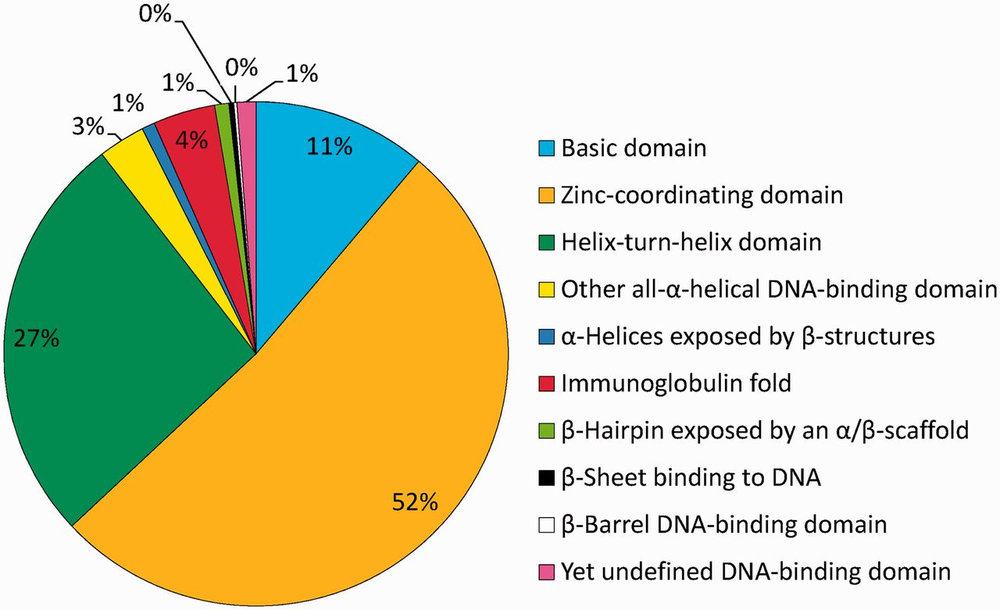
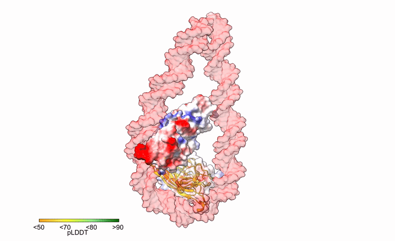
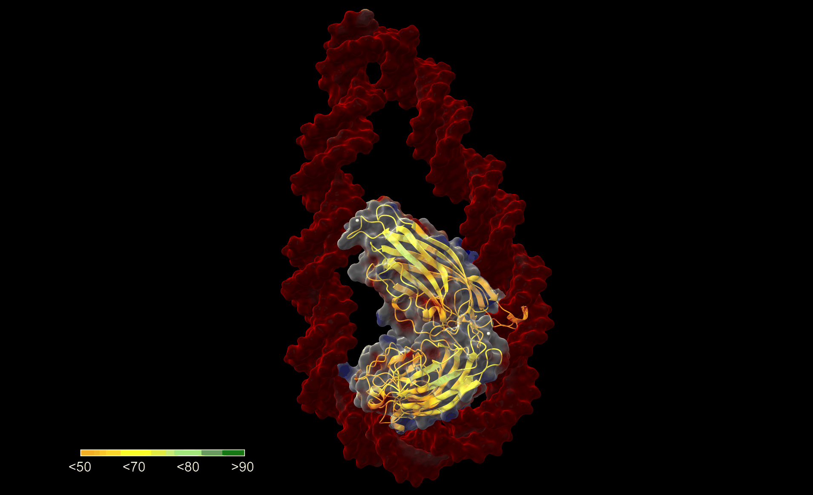
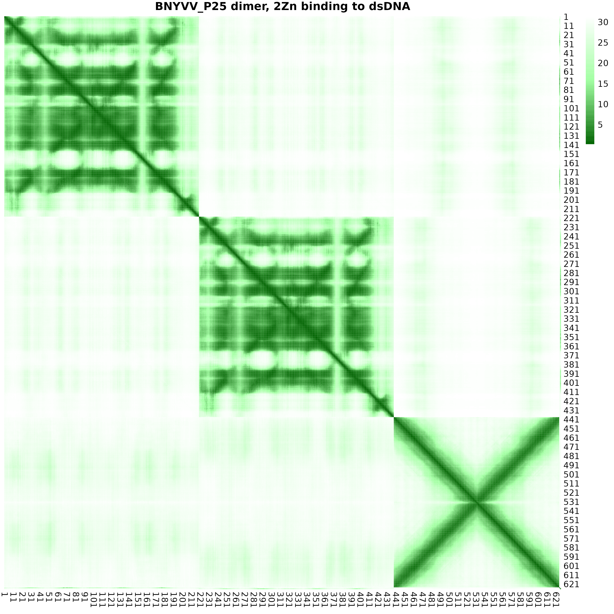
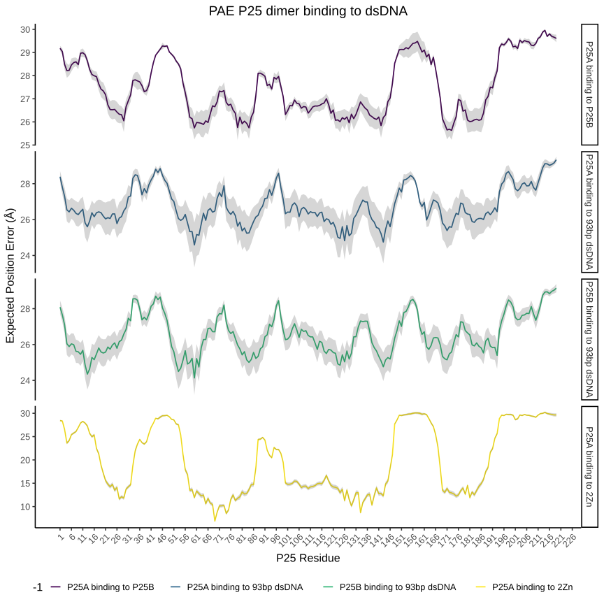
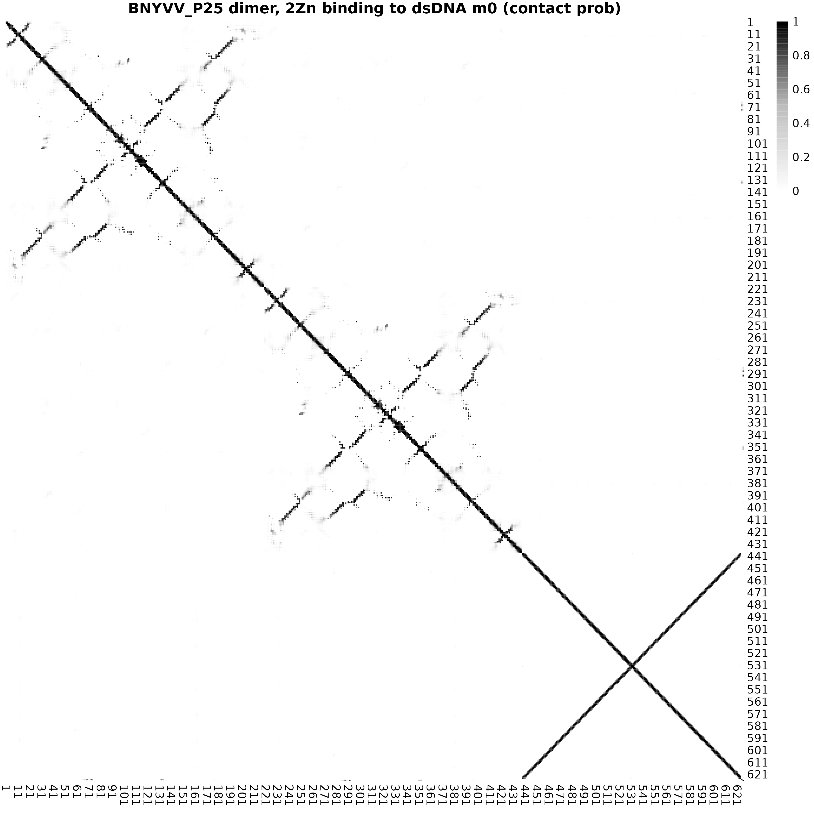
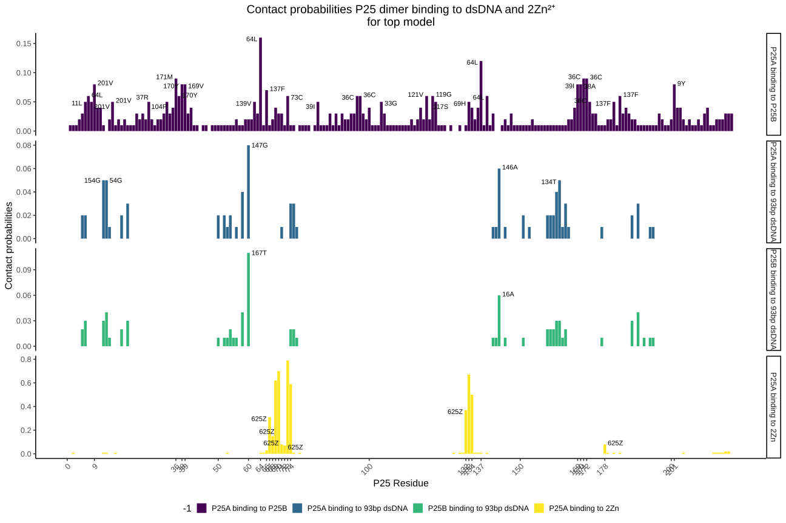
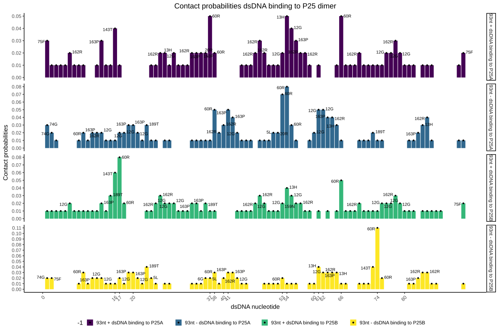
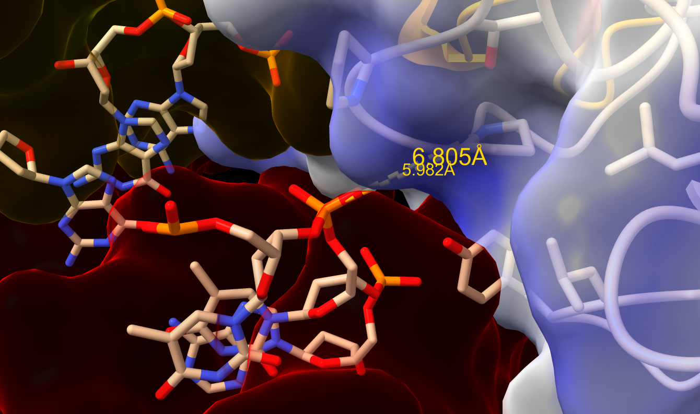

Beet necrotic yellow vein virus (BNYVV) P25 protein functions as a chromatin‑associated transcriptional repressor that preferentially binds distal promoter regions of nuclear genes associated with mitochondrial and chloroplast functions.

```{r setup, include=FALSE}
knitr::opts_chunk$set(echo = TRUE)
```

```{r,include=FALSE }
library(ggplot2)
library("Biostrings")
library("ggseqlogo")
library(plyr)
library(dplyr)
library(ggrepel)
library(cowplot)
library(reshape2)
library(scales)
library(readr)
library(grid)
library(gridExtra)

# Load PAE or PDE matrices for multiple models
load_model_matrices <- function(prefix, metric, models = 0:4, transpose = TRUE) {
  lapply(models, function(i) {
    path <- sprintf("CP_PAE_PDE/%s_%s_%d.csv.gz", prefix, metric, i)
    mat <- as.matrix(read.csv(path, header = FALSE))
    if (transpose) t(mat) else mat
  })
}

process_pae_models_indexing <- function(model_list, row_range, col_range, interaction_name, Type) {
  
  # Initialize an empty list to store data frames
  df_list <- list()
  
  # Loop through each model
  for (i in seq_along(model_list)) {
    model <- model_list[[i]]
    
    # Extract the relevant section of the matrix
    sub_matrix <- model[row_range, col_range]
    
    # Compute minimal PAE per residue and retrieve index
    min_pae <- apply(sub_matrix, 2, min)
    min_index <- apply(sub_matrix, 2, which.min)  # Row index of min PAE
    
    # Adjust indices to reflect the actual row numbers in the full matrix
    min_index_adj <- row_range[min_index]
    
    # Create a data frame
    df <- data.frame(
      Interaction = interaction_name,
      Residue = col_range,  # The residue being evaluated
      MinPAE = min_pae,
      MinPAE_Index = min_index_adj,  # The row index where min PAE was found
      Type = Type,
      Model = as.character(i - 1)  # Assuming models are indexed from 0
    )
    
    # Append to the list
    df_list[[i]] <- df
  }
  
  # Combine all data frames into one
  return(bind_rows(df_list))
}

process_contactP_models_indexing <- function(model_list, row_range, col_range, interaction_name, Type) {
  
  # Initialize an empty list to store data frames
  df_list <- list()
  
  # Loop through each model
  for (i in seq_along(model_list)) {
    model <- model_list[[i]]
    
    # Extract the relevant section of the matrix
    sub_matrix <- model[row_range, col_range]
    
    # Compute minimal PAE per residue and retrieve index
    min_pae <- apply(sub_matrix, 2, max)
    min_index <- apply(sub_matrix, 2, which.max)  # Row index of min PAE
    
    # Adjust indices to reflect the actual row numbers in the full matrix
    min_index_adj <- row_range[min_index]
    
    # Create a data frame
    df <- data.frame(
      Interaction = interaction_name,
      Residue = col_range,  # The residue being evaluated
      MinPAE = min_pae,
      MinPAE_Index = min_index_adj,  # The row index where min PAE was found
      Type = Type,
      Model = as.character(i - 1)  # Assuming models are indexed from 0
    )
    
    # Append to the list
    df_list[[i]] <- df
  }
  
  # Combine all data frames into one
  return(bind_rows(df_list))
}
# ---- Function: one strip plot per row with its own scale ----
make_strip <- function(df_row, row_name, high_col, show_x = FALSE,length, label_x, show_title = TRUE) {
  max_cp <- max(df_row$CP, na.rm = TRUE)
  df_row <- df_row %>%
    mutate(CP_row = if (max_cp > 0) CP / max_cp else 0)

  p <- ggplot(df_row, aes(x = Residue, y = 1, fill = CP_row)) +
    geom_tile(height = 0.9) +
    scale_fill_gradient(low = "white", high = high_col, limits = c(0, 1), oob = scales::squish) +
    scale_y_continuous(NULL, breaks = NULL) +
    theme_void(base_size = 11) +
    theme(
      plot.margin = margin(2, 2, 2, 2),
      legend.position = "none"
    )

  # Optional title
  if (show_title) {
    p <- p + labs(title = row_name) +
      theme(plot.title = element_text(hjust = 0, size = 10, margin = margin(b = 2)))
  }

  # Add x-axis only on bottom strip
  if (show_x) {
    p <- p +
      theme(
        axis.text.x = element_text(size = 8),
        axis.ticks.x = element_line(linewidth = 0.2),
        axis.line.x  = element_line(linewidth = 0.2),
        axis.title.x = element_text(size = 10, margin = margin(t = 4))
      ) +
      labs(x = label_x) +
      scale_x_continuous(breaks = pretty(c(1, length), n = 8), expand = c(0, 0))
  } else {
    p <- p + scale_x_continuous(expand = c(0, 0))
  }

  p
}

df_to_rmd_table <- function(df,print_table = TRUE) { 
  
  header <- paste0("| ", paste(names(df), collapse = " | "), " |")
  align  <- paste0("| ", paste(rep("---", ncol(df)), collapse = " | "), " |")
  body <- apply(df, 1, function(row) paste0("| ", paste(row, collapse = " | "), " |"))

  md <- paste(c(header, align, body), collapse = "\n")

  if (print_table) cat(md, "\n")
} 
```

# Zinc-Coordinatin DNA Binding Domain

[Among the ten super classes of defined DBDs](https://genexplain.com/what-are-transcription-factors/), by far the largest is Superclass 2 (zinc-coordinating DBDs) to which 53% of all Human TF genes belong to, followed by helix-turn-helix (26%) and basic domain factor genes (11%). These three super classes have in common that an α-helix is exposed in such a way that it binds into the major groove of the DNA @wingender2013tfclass. 

::: {style="text-align: center;"}
<figure>
```{=html}

```
<figcaption style="margin-top: 10px;">

<strong>Relative sizes of human TF superclasses. The distribution of TF genera among the 10 superclasses, with the percentages indicated</strong>

</figcaption>
</figure>
<a name="9DBDs.jpeg"></a>
:::

# Other models 

```{r, eval=FALSE}
ViralTFs_BNYVV_P25_models<- read.csv("Results/ViralTFs_BNYVV_P25_models.csv", header = T)
ViralTFs_BNYVV_P25_models$models <- gsub("ViralTFs_BNYVV_P25_","",ViralTFs_BNYVV_P25_models$models)
df_to_rmd_table(ViralTFs_BNYVV_P25_models)
```
| models | has_clash | ptm | iptm | ranking_score | num_recycles | fraction_disordered |
| --- | --- | --- | --- | --- | --- | --- |
| ssDNA_4 | 0 | 0.63 | 0.29 |  0.39 | 10.00 | 0.06 |
| ssDNA_3 | 0 | 0.64 | 0.34 |  0.42 | 10.00 | 0.04 |
| dimer_dsDNA_1 | 0 | 0.25 | 0.39 | 61.09 |  0.28 | 1.93 |
| dimer_dsDNA_2 | 0 | 0.22 | 0.39 | 60.45 |  0.26 | 1.90 |
| dimer_dsDNA_3 | 0 | 0.22 | 0.39 | 60.86 |  0.25 | 1.92 |
| dimer_dsDNA_4 | 0 | 0.20 | 0.39 | 60.86 |  0.24 | 1.92 |
| ssDNA_2 | 0 | 0.63 | 0.39 |  0.44 | 10.00 | 0.01 |
| dimer_dsDNA_0 | 0 | 0.26 | 0.40 | 61.69 |  0.29 | 1.91 |
| ssDNA_1 | 0 | 0.69 | 0.42 |  0.47 | 10.00 | 0.00 |
| ssDNA_0 | 0 | 0.72 | 0.60 |  0.62 | 10.00 | 0.00 |
| monomer_1Zn_dsDNA_4 | 0 | 0.51 | 0.75 | 86.50 |  0.56 | 0.55 |
| dimer_2Zn_ssDNA_4 | 0 | 0.70 | 0.80 | 64.00 |  0.72 | 0.71 |
| dimer_2Zn_dsDNA_4 | 0 | 0.73 | 0.82 | 69.00 |  0.75 | 0.59 |
| dimer_2Zn_ssDNA_3 | 0 | 0.73 | 0.82 | 64.00 |  0.75 | 0.69 |
| dimer_2Zn_ssDNA_2 | 0 | 0.74 | 0.82 | 63.25 |  0.75 | 0.67 |
| dimer_2Zn_ssDNA_1 | 0 | 0.74 | 0.82 | 63.25 |  0.76 | 0.69 |
| dimer_2Zn_dsDNA_3 | 0 | 0.74 | 0.82 | 70.50 |  0.76 | 0.61 |
| dimer_2Zn_ssDNA_0 | 0 | 0.75 | 0.83 | 64.50 |  0.77 | 0.69 |
| monomer_1Zn_dsDNA_3 | 0 | 0.87 | 0.88 | 88.50 |  0.87 | 0.37 |
| monomer_1Zn_dsDNA_2 | 0 | 0.88 | 0.89 | 89.00 |  0.88 | 0.38 |
| dimer_2Zn_dsDNA_2 | 0 | 0.85 | 0.89 | 70.00 |  0.86 | 0.50 |
| monomer_1Zn_dsDNA_0 | 0 | 0.89 | 0.89 | 89.50 |  0.89 | 0.36 |
| monomer_1Zn_dsDNA_1 | 0 | 0.89 | 0.90 | 88.00 |  0.89 | 0.37 |
| dimer_2Zn_dsDNA_1 | 0 | 0.86 | 0.90 | 71.00 |  0.87 | 0.47 |
| dimer_2Zn_dsDNA_0 | 0 | 0.92 | 0.93 | 72.50 |  0.92 | 0.42 | 

Correct ! 
# Dimeric P25 binding to 93dsDNA and 2Zn²⁺

::: {style="text-align: center;"}
<figure>
```{=html}

```
<figcaption style="margin-top: 10px;">

<strong>Contact probability of P25 dimer binding to 2 Zn²⁺ions and 93bp dsDNA, model 1</strong>

</figcaption>
</figure>
<a name="Protenix_BNYVV_P25_P19229_dimer_2Zn_dsDNA_cprob_m1.png"></a>
:::

## Json files 

The Viral TF P25 sequence used for structural modeling

```
>BNYVV_P25
MGDILGAVYDLGHRPYLARRTVYEDRLILSTHGNICRAINLLTHDNRTTLVYHNNTKRIRFRGLLCALHGPYCGFRALCRVMLCSLPRLCDIPINGSRDFVADPTRLDSSVNELLVSNGLVIHYDRVHHVPLHTDGFEVVDFTTVFRGPGNFLLPNATNFPRPTTTDQVYMVCLVNTVNCVLRFESELTVWVHSGLYTGDVLDVDNNVIQAPDGVDDDG

>DNA_ChIP_Motif_For
TTCGTGGCC**GGAAAGAGGCAAAAGAAGACTAGCTTAC**ACCTCATGGGGGTCAAGCAAGAGAAGAATGAAAGTCTAGCCGACTACATAAAAAGA
>DNA_ChIP_Motif_Rev
TCTTTTTATGTAGTCGGCTAGACTTTCATTCTTCTCTTGCTTGACCCCCATGAGGTGTAAGCTAGTCTTCTTTTGCCTCTTTCCGGCCACGAA
>ion_ZN
```

```{bash, eval=F}
module load bioinfo-tools biopython/1.80-py3.10.8
python3 -m json.tool BNYVV_P25_P19229_dimer_2Zn_dsDNA.json   > BNYVV_P25_P19229_dimer_2Zn_dsDNA_cor.json
protenix predict --input BNYVV_P25_P19229_dimer_2Zn_dsDNA_cor.json  --out_dir BNYVV_P25_P19229/ --use_msa_server  --seeds 93187

bash inference_parameter.sh BNYVV_P25_P19229/BNYVV_P25_P19229_dimer_2Zn_dsDNA-add-msa.json BNYVV_P25_P19229/Dimer_Zn/ 93187

bash Code/ranking.sh
bash Code/rmarkdown_format.sh models_ranking.txt
```

| models| disorder  |	iptm  |	ptm  |	plddt  |	ranking_score  |	gpde |
| --- | --- | --- | --- | --- | --- | --- |
| model_0 |0.0 |	0.187	 |0.328 |	61.478 |	0.215 |	1.918 |
| model_1	 |0.0	 |0.172	 |0.329 |	62.364 |	0.203 |	1.931|
| model_2	 |0.0	 |0.166 |	0.329 |	61.060 |	0.198 |	1.99 |
| model_3	 |0.0	 |0.162 |	0.328 |	60.658 |	0.196 |	1.979 |
| model_4 |	0.0 |	0.157 |	0.327 |	61.877 | 0.191 |	1.992 |

::: {style="text-align: center;"}
<figure>
```{=html}

```
<figcaption style="margin-top: 10px;">

<strong>Top model (m0) for P25 dimer binding to 2 Zn²⁺ ions and 93bp dsDNA</strong>

</figcaption>
</figure>
<a name="M0_P25_dsDNA_2Zn.png"></a>
:::

## Contact probablities extraction 

```{bash, eval=F}
perl extract_pae_pde_contactprob_protenix.pl /home/aiaz0001/ProteinDisorder/ViralTFs_BNYVV_P25/Protenix_BNYVV_P25_P19229_dimer_2Zn_ssDNA/LocalRunPAE/Protenix_BNYVV_P25_P19229_dimer_2Zn_dsDNA/seed_93187/predictions/Protenix_BNYVV_P25_P19229_dimer_2Zn_dsDNA_full_data_sample_1.json contact_probs  Protenix_BNYVV_P25_P19229_dimer_2Zn_dsDNA_contactProb_m1.csv    

for f  in {0..4}; do perl extract_pae_pde_contactprob_protenix.pl Protenix_BNYVV_P25_P19229_dimer_2Zn_dsDNA_full_data_sample_"$f".json token_pair_pae Protenix_BNYVV_P25_P19229_dimer_2Zn_dsDNA_full_data_sample_"$f".csv ; done 

for f  in {0..4}; do perl extract_pae_pde_contactprob_protenix.pl Protenix_BNYVV_P25_P19229_dimer_2Zn_dsDNA_full_data_sample_"$f".json token_pair_pde Protenix_BNYVV_P25_P19229_dimer_2Zn_dsDNA_full_data_sample_"$f".csv ; done 

module load PDCOLD/23.12  R/4.4.0

Rscript Code/contact_prob.R Protenix_BNYVV_P25_P19229_dimer_2Zn_dsDNA_contactProb_m1.csv "BNYVV_P25 dimer, 2Zn binding to dsDNA"  P25_P19229_dimer_2Zn_dsDNA_contactProb.png

Rscript Code/pae_matrix.R Protenix_BNYVV_P25_P19229_dimer_2Zn_dsDNA_pae_m1.csv "BNYVV_P25 dimer, 2Zn binding to dsDNA" Protenix_BNYVV_P25_P19229_dimer_2Zn_dsDNA_pae_m1.png

Rscript Code/pae_matrix.R Protenix_BNYVV_P25_P19229_dimer_2Zn_dsDNA_pde_m1.csv "TpUGT89B1_DON_UDP" Protenix_BNYVV_P25_P19229_dimer_2Zn_dsDNA_pde_m1.png
```


### PAE top model 
::: {style="text-align: center;"}
<figure>
```{=html}

```
<figcaption style="margin-top: 10px;">

<strong>Protenix PAE of P25 dimer binding to 2 Zn²⁺ ions and 93bp dsDNA, model </strong>

</figcaption>
</figure>
<a name="Protenix_BNYVV_P25_P19229_dimer_2Zn_dsDNA_pae_m1.png"></a>
:::

# Interaction surface index analysis 

```{r, eval=FALSE}
P25_dsDNA_0 <- as.matrix(read.csv("CP_PAE_PDE/Protenix_BNYVV_P25_P19229_dimer_2Zn_dsDNA_full_data_sample_0_pae.csv.gz", header = FALSE))
P25_dsDNA_1 <- as.matrix(read.csv("CP_PAE_PDE/Protenix_BNYVV_P25_P19229_dimer_2Zn_dsDNA_full_data_sample_1_pae.csv.gz", header = FALSE))
P25_dsDNA_2 <- as.matrix(read.csv("CP_PAE_PDE/Protenix_BNYVV_P25_P19229_dimer_2Zn_dsDNA_full_data_sample_2_pae.csv.gz", header = FALSE))
P25_dsDNA_3 <- as.matrix(read.csv("CP_PAE_PDE/Protenix_BNYVV_P25_P19229_dimer_2Zn_dsDNA_full_data_sample_3_pae.csv.gz", header = FALSE))
P25_dsDNA_4 <- as.matrix(read.csv("CP_PAE_PDE/Protenix_BNYVV_P25_P19229_dimer_2Zn_dsDNA_full_data_sample_4_pae.csv.gz", header = FALSE))

model_list <- list(t(P25_dsDNA_0),t( P25_dsDNA_1), t(P25_dsDNA_2), t(P25_dsDNA_3), t(P25_dsDNA_4))

P25_dimer_pae <- process_pae_models_indexing(model_list, 1:219, 220:438,"P25A binding to P25B","Medium")
P25_dimer_pae$Residue <- P25_dimer_pae$Residue - 219 

P25A_dimer_pae <- process_pae_models_indexing(model_list, 533:624,220:438,"P25A binding to 93bp dsDNA","Weak")
P25A_dimer_pae$Residue <- P25A_dimer_pae$Residue - 219
P25A_dimer_pae$MinPAE_Index <- P25A_dimer_pae$MinPAE_Index - 532

P25B_dimer_pae <- process_pae_models_indexing(model_list, 533:624,1:219,"P25B binding to 93bp dsDNA","Weak")
P25B_dimer_pae$MinPAE_Index <- P25B_dimer_pae$MinPAE_Index - 532

P25_Zn_CP_pae <- process_pae_models_indexing(model_list, 624:626,1:219,"P25A binding to 2Zn","Strong")
P25_Zn_CP_pae$MinPAE_Index <- P25_Zn_CP_pae$MinPAE_Index - 624

P25Ad_dsDNA_DF_ALL <-  rbind.data.frame(P25_dimer_pae,P25A_dimer_pae,P25B_dimer_pae,P25_Zn_CP_pae)

P25Ad_dsDNA_DF_summary <- P25Ad_dsDNA_DF_ALL %>%
    group_by(Interaction,Residue,Type) %>%
    summarize(
        mean_value = mean(MinPAE),
        sd_value = sd(MinPAE),  # Standard deviation
        n = n(),
        se_value = sd(MinPAE) / sqrt(n())  # Standard error
    )

P25Ad_dsDNA_DF_summary$Interaction<- factor(P25Ad_dsDNA_DF_summary$Interaction, levels = c("P25A binding to P25B",
                                                                               "P25A binding to 93bp dsDNA",
                                                                               "P25B binding to 93bp dsDNA", 
                                                                               "P25A binding to 2Zn"))

P25d_dsDNA_all_plot <- ggplot(P25Ad_dsDNA_DF_summary, aes(x = Residue, y = mean_value  ,  colour =Interaction)) +
     scale_colour_viridis_d()  +   geom_line(size = 0.8, linetype = "solid") +
  geom_ribbon(aes(ymin = mean_value - se_value, ymax = mean_value + se_value), alpha = 0.2, colour = NA ) +
     labs(title = "PAE P25 dimer binding to dsDNA",
          x = "P25 Residue", y = "Expected Position Error (Å)",
          color = "Interaction") +  theme_classic(base_size = 16)  +
     #scale_x_continuous(breaks = seq(1, length(P25Ad_dsDNA_DF_summary$Residue), by = 5)) + 
     theme(axis.text.x = element_text(angle = 45, vjust = 1, hjust=1),plot.title = element_text(hjust = 0.5),legend.position = "bottom") +
     facet_grid(Interaction~., scales = "free")  

ggsave(filename = "Figures/ViralTFs_BNYVV_P25_pae_plot.svg", plot = P25d_dsDNA_all_plot,device = "svg", width=12, height=12)


P25Ad_dsDNA_DF_ALL$Interaction<- factor(P25Ad_dsDNA_DF_ALL$Interaction, levels = c("P25A binding to P25B",
                                                                               "P25A binding to 93bp dsDNA",
                                                                               "P25B binding to 93bp dsDNA", 
                                                                               "P25A binding to 2Zn"))
P25d_dsDNA_independent_plot <-  ggplot(P25Ad_dsDNA_DF_ALL, aes(x = Residue, y = MinPAE  ,  colour =Model)) +
           scale_colour_viridis_d()  +   geom_line(size = 0.8, linetype = "solid") +
    labs(x = "P25 Residue", y = "Expected Position Error (Å)",
         color = "Model") +  
 # scale_x_continuous(breaks = seq(1, length(P25Ad_dsDNA_DF_summary$Residue), by = 5)) + 
   theme_bw(base_size = 20) +
     theme(axis.text.x = element_text(angle = 45, vjust = 1, hjust=1),
           legend.position = "bottom",
    strip.background = element_blank()) +
  facet_grid(Interaction~., scales = "free")  
  ggsave(filename = "Figures/ViralTFs_BNYVV_P25_pae_plot.pdf", plot = P25d_dsDNA_independent_plot,device = "pdf", width=6, height=5)


```
::: {style="text-align: center;"}
<figure>
```{=html}

```
<figcaption style="margin-top: 10px;">

<strong>Linear PAE of P25 dimer binding to 2 Zn²⁺ ions and 93bp dsDNA, model 1</strong>

</figcaption>
</figure>
<a name="ViralTFs_BNYVV_P25_pae_plot.svg"></a>
:::


### Contact probability in interaction surface

::: {style="text-align: center;"}
<figure>
```{=html}

```
<figcaption style="margin-top: 10px;">

<strong>Protenix Contact  probabilitie of P25 dimer binding to 2 Zn²⁺ ions and 93bp dsDNA, model 1</strong>

</figcaption>
</figure>
<a name="Protenix_BNYVV_P25_P19229_dimer_2Zn_dsDNA_cprob_m0.png"></a>
:::


```{r, eval=FALSE}
 colnames_seq <- paste0( "MGDILGAVYDLGHRPYLARRTVYEDRLILSTHGNICRAINLLTHDNRTTLVYHNNTKRIRFRGLLCALHGPYCGFRALCRVMLCSLPRLCDIPINGSRDFVADPTRLDSSVNELLVSNGLVIHYDRVHHVPLHTDGFEVVDFTTVFRGPGNFLLPNATNFPRPTTTDQVYMVCLVNTVNCVLRFESELTVWVHSGLYTGDVLDVDNNVIQAPDGVDDDG","MGDILGAVYDLGHRPYLARRTVYEDRLILSTHGNICRAINLLTHDNRTTLVYHNNTKRIRFRGLLCALHGPYCGFRALCRVMLCSLPRLCDIPINGSRDFVADPTRLDSSVNELLVSNGLVIHYDRVHHVPLHTDGFEVVDFTTVFRGPGNFLLPNATNFPRPTTTDQVYMVCLVNTVNCVLRFESELTVWVHSGLYTGDVLDVDNNVIQAPDGVDDDG", "TTCGTGGCCGGAAAGAGGCAAAAGAAGACTAGCTTACACCTCATGGGGGTCAAGCAAGAGAAGAATGAAAGTCTAGCCGACTACATAAAAAGA", 
"TCTTTTTATGTAGTCGGCTAGACTTTCATTCTTCTCTTGCTTGACCCCCATGAGGTGTAAGCTAGTCTTCTTTTGCCTCTTTCCGGCCACGAA", 
"Z","Z", collapse = "") 
nt_seq <- paste0( "TTCGTGGCCGGAAAGAGGCAAAAGAAGACTAGCTTACACCTCATGGGGGTCAAGCAAGAGAAGAATGAAAGTCTAGCCGACTACATAAAAAGA", 
"TCTTTTTATGTAGTCGGCTAGACTTTCATTCTTCTCTTGCTTGACCCCCATGAGGTGTAAGCTAGTCTTCTTTTGCCTCTTTCCGGCCACGAA", 
"Z","Z", collapse = "") 
colsplit <- strsplit(colnames_seq, "")[[1]]
colsplit_nt_seq <- strsplit(nt_seq, "")[[1]]


colsplit_number <- paste0(seq(1,626), colsplit, sep="")
colsplit_nt_seq_number <- paste0(seq(1,188), colsplit_nt_seq, sep="")

P25_dimer_2Zn_dsDNA_1  <- as.matrix(read.csv("CP_PAE_PDE/Protenix_BNYVV_P25_P19229_dimer_2Zn_dsDNA_contactProb_m1.csv", header = FALSE))
model_list <- list(t(P25_dimer_2Zn_dsDNA_1))

#BNYVV_P25A_dsDNA_CP <- process_contactP_models_indexing(model_list, 439:532,1:219,"P25A binding to 93bp dsDNA","Unique")
BNYVV_P25A_dsDNA_CP <- process_contactP_models_indexing(model_list, 439:624,1:219,"P25A binding to 93bp dsDNA","Unique")
BNYVV_P25A_dsDNA_CP$ResidueName <- colsplit_number[BNYVV_P25A_dsDNA_CP$Residue]
BNYVV_P25A_dsDNA_CP$MinPAE_Index <- BNYVV_P25A_dsDNA_CP$MinPAE_Index - 438
BNYVV_P25A_dsDNA_CP$InterName <- colsplit_nt_seq_number[BNYVV_P25A_dsDNA_CP$MinPAE_Index]


BNYVV_P25B_dsDNA_CP <- process_contactP_models_indexing(model_list, 439:624,220:438,"P25B binding to 93bp dsDNA","Unique")
BNYVV_P25B_dsDNA_CP$Residue <- BNYVV_P25B_dsDNA_CP$Residue - 219
BNYVV_P25B_dsDNA_CP$ResidueName <- colsplit_number[BNYVV_P25B_dsDNA_CP$Residue]
BNYVV_P25B_dsDNA_CP$MinPAE_Index <- BNYVV_P25B_dsDNA_CP$MinPAE_Index - 438
BNYVV_P25B_dsDNA_CP$InterName <- colsplit_nt_seq_number[BNYVV_P25B_dsDNA_CP$MinPAE_Index]


BNYVV_P25_dimer_CP <- process_contactP_models_indexing(model_list, 1:219, 220:439,"P25A binding to P25B","Unique")

BNYVV_P25_dimer_CP$ResidueName <- colsplit_number[BNYVV_P25_dimer_CP$Residue]
BNYVV_P25_dimer_CP$InterName <- colsplit_number[BNYVV_P25_dimer_CP$MinPAE_Index]
BNYVV_P25_dimer_CP$Residue  <- BNYVV_P25_dimer_CP$Residue - 219


BNYVV_P25_Zn_CP <- process_contactP_models_indexing(model_list, 625:626,1:219,"P25A binding to 2Zn","Unique")
BNYVV_P25_Zn_CP$InterName <- colsplit_number[BNYVV_P25_Zn_CP$MinPAE_Index]
BNYVV_P25_Zn_CP$ResidueName <- colsplit_number[BNYVV_P25_Zn_CP$Residue]


BNYVV_P25d_dsDNA  <-  rbind.data.frame(BNYVV_P25A_dsDNA_CP,BNYVV_P25B_dsDNA_CP, BNYVV_P25_dimer_CP,BNYVV_P25_Zn_CP)

highlight_residues <- BNYVV_P25d_dsDNA[BNYVV_P25d_dsDNA$MinPAE >= 0.07,2] 

BNYVV_P25d_dsDNA$Interaction<- factor(BNYVV_P25d_dsDNA$Interaction, levels = c("P25A binding to P25B",
                                                                               "P25A binding to 93bp dsDNA",
                                                                               "P25B binding to 93bp dsDNA", 
                                                                               "P25A binding to 2Zn"))
BNYVV_P25d_dsDNA_plot <- ggplot(BNYVV_P25d_dsDNA[BNYVV_P25d_dsDNA$MinPAE > 0,], aes(x = Residue, y = MinPAE ,  fill =Interaction)) +
     #scale_color_manual(values = colors) + 
      scale_fill_viridis_d()  +  
  #geom_line(size = 0.8, linetype = "solid") +
 geom_col() + 
    # geom_text_repel(aes(label =ifelse(MinPAE < 0.4 & MinPAE > 0.05 , InterName , NA)),segment.size = 0.3)  +   # index < 25 for P6B
    labs(x = "P25 Residue", y = "Contact probabilities",
         color = "Interaction") + 
  #scale_x_continuous(breaks = seq(1, length(P6dimmer$Residue), by = 5)) + 
   theme_bw(base_size = 20) +
     theme(axis.text.x = element_text(angle = 45, vjust = 1, hjust=1),
           legend.position = "bottom",strip.text.y = element_blank(),
    strip.background = element_blank()) +
     facet_grid(Interaction~., scales = "free_y") 
  #scale_y_continuous(breaks = seq(0, 1, by = 0.05))  +
  # keep defaults and add highlight_residues as extra breaks
  #scale_x_continuous(breaks = function(x) { unique(c(pretty(x), highlight_residues)) })          

 ggsave(filename = "Figures/ViralTFs_BNYVV_P25_CP_plot.svg", plot = BNYVV_P25d_dsDNA_plot,device = "svg", width=18, height=12)
 
 ggsave(filename = "Figures/ViralTFs_BNYVV_P25_CP_plot.pdf", plot = BNYVV_P25d_dsDNA_plot,device = "pdf", width=6, height=5)
```

::: {style="text-align: center;"}
<figure>
```{=html}

```
<figcaption style="margin-top: 10px;">

<strong>Linear Contact probabilities of P25 dimer binding to 2 Zn²⁺ ions and 93bp dsDNA, model 1</strong>

</figcaption>
</figure>
<a name="ViralTFs_BNYVV_P25_CP_plot.svg"></a>
:::

#### Contact probabilities dsDNA to P25

```{r, eval=FALSE}

  colnames_seq <- paste0( "MGDILGAVYDLGHRPYLARRTVYEDRLILSTHGNICRAINLLTHDNRTTLVYHNNTKRIRFRGLLCALHGPYCGFRALCRVMLCSLPRLCDIPINGSRDFVADPTRLDSSVNELLVSNGLVIHYDRVHHVPLHTDGFEVVDFTTVFRGPGNFLLPNATNFPRPTTTDQVYMVCLVNTVNCVLRFESELTVWVHSGLYTGDVLDVDNNVIQAPDGVDDDG","MGDILGAVYDLGHRPYLARRTVYEDRLILSTHGNICRAINLLTHDNRTTLVYHNNTKRIRFRGLLCALHGPYCGFRALCRVMLCSLPRLCDIPINGSRDFVADPTRLDSSVNELLVSNGLVIHYDRVHHVPLHTDGFEVVDFTTVFRGPGNFLLPNATNFPRPTTTDQVYMVCLVNTVNCVLRFESELTVWVHSGLYTGDVLDVDNNVIQAPDGVDDDG", "TTCGTGGCCGGAAAGAGGCAAAAGAAGACTAGCTTACACCTCATGGGGGTCAAGCAAGAGAAGAATGAAAGTCTAGCCGACTACATAAAAAGA", 
"TCTTTTTATGTAGTCGGCTAGACTTTCATTCTTCTCTTGCTTGACCCCCATGAGGTGTAAGCTAGTCTTCTTTTGCCTCTTTCCGGCCACGAA", 
"Z","Z", collapse = "") 
colsplit <- strsplit(colnames_seq, "")[[1]]
colsplit_number <- paste0(seq(1,626), colsplit, sep="")

P25_dimer_2Zn_dsDNA_1 <- as.matrix(read.csv("CP_PAE_PDE/Protenix_BNYVV_P25_P19229_dimer_2Zn_dsDNA_contactProb_m1.csv", header = FALSE))

model_list <- list(t(P25_dimer_2Zn_dsDNA_1))


#BNYVV_P25A_dsDNA_CP <- process_contactP_models_indexing(model_list, 439:532,1:219,"P25A binding to 93bp dsDNA","Unique")
BNYVV_P25A_dsDNA_CP_neg <- process_contactP_models_indexing(model_list, 1:219,532:624,"93nt - dsDNA binding to P25A","Negative strand")
BNYVV_P25A_dsDNA_CP_neg$ResidueName <- colsplit_number[BNYVV_P25A_dsDNA_CP_neg$Residue]
BNYVV_P25A_dsDNA_CP_neg$InterName <- colsplit_number[BNYVV_P25A_dsDNA_CP_neg$MinPAE_Index]
BNYVV_P25A_dsDNA_CP_neg$Residue <- BNYVV_P25A_dsDNA_CP_neg$Residue - 531
 
BNYVV_P25A_dsDNA_CP_pos <- process_contactP_models_indexing(model_list, 1:219,439:531,"93nt + dsDNA binding to P25A","Positive strand")
BNYVV_P25A_dsDNA_CP_pos$ResidueName <- colsplit_number[BNYVV_P25A_dsDNA_CP_pos$Residue]
BNYVV_P25A_dsDNA_CP_pos$InterName <- colsplit_number[BNYVV_P25A_dsDNA_CP_pos$MinPAE_Index]
BNYVV_P25A_dsDNA_CP_pos$Residue <- BNYVV_P25A_dsDNA_CP_pos$Residue - 438

BNYVV_P25B_dsDNA_CP_neg  <- process_contactP_models_indexing(model_list, 220:438,532:624,"93nt - dsDNA binding to P25B","Negative strand")
BNYVV_P25B_dsDNA_CP_neg$ResidueName <- colsplit_number[BNYVV_P25B_dsDNA_CP_neg$Residue]
BNYVV_P25B_dsDNA_CP_neg$Residue <- BNYVV_P25B_dsDNA_CP_neg$Residue - 531
BNYVV_P25B_dsDNA_CP_neg$MinPAE_Index <- BNYVV_P25B_dsDNA_CP_neg$MinPAE_Index - 219
BNYVV_P25B_dsDNA_CP_neg$InterName <- colsplit_number[BNYVV_P25B_dsDNA_CP_neg$MinPAE_Index]

BNYVV_P25B_dsDNA_CP_pos <- process_contactP_models_indexing(model_list, 220:438,439:531,"93nt + dsDNA binding to P25B","Positive strand")
BNYVV_P25B_dsDNA_CP_pos$ResidueName <- colsplit_number[BNYVV_P25B_dsDNA_CP_pos$Residue]
BNYVV_P25B_dsDNA_CP_pos$Residue <- BNYVV_P25B_dsDNA_CP_pos$Residue - 438
BNYVV_P25B_dsDNA_CP_pos$MinPAE_Index <- BNYVV_P25B_dsDNA_CP_pos$MinPAE_Index - 219
BNYVV_P25B_dsDNA_CP_pos$InterName <- colsplit_number[BNYVV_P25B_dsDNA_CP_pos$MinPAE_Index]

BNYVV_Zn_dsDNA_CP_pos <- process_contactP_models_indexing(model_list, 625:626,439:531,"93nt + dsDNA binding to Zn","Positive strand")
BNYVV_Zn_dsDNA_CP_pos$ResidueName <- colsplit_number[BNYVV_Zn_dsDNA_CP_pos$Residue]
BNYVV_Zn_dsDNA_CP_pos$Residue <- BNYVV_Zn_dsDNA_CP_pos$Residue - 438
#BNYVV_Zn_dsDNA_CP_pos$MinPAE_Index <- BNYVV_Zn_dsDNA_CP_pos$MinPAE_Index - 219
BNYVV_Zn_dsDNA_CP_pos$InterName <- colsplit_number[BNYVV_Zn_dsDNA_CP_pos$MinPAE_Index]


BNYVV_Zn_dsDNA_CP_neg <- process_contactP_models_indexing(model_list, 625:626,532:624,"93nt - dsDNA binding to Zn","Negative strand")
BNYVV_Zn_dsDNA_CP_neg$ResidueName <- colsplit_number[BNYVV_Zn_dsDNA_CP_neg$Residue]
BNYVV_Zn_dsDNA_CP_neg$Residue <- BNYVV_Zn_dsDNA_CP_neg$Residue - 531
#BNYVV_Zn_dsDNA_CP_pos$MinPAE_Index <- BNYVV_Zn_dsDNA_CP_pos$MinPAE_Index - 219
BNYVV_Zn_dsDNA_CP_neg$InterName <- colsplit_number[BNYVV_Zn_dsDNA_CP_neg$MinPAE_Index]

BNYVV_dsDNA_P25d  <-  rbind.data.frame(BNYVV_P25A_dsDNA_CP_pos,BNYVV_P25A_dsDNA_CP_neg, BNYVV_P25B_dsDNA_CP_pos, BNYVV_P25B_dsDNA_CP_neg,
                                       BNYVV_Zn_dsDNA_CP_pos,BNYVV_Zn_dsDNA_CP_neg)

highlight_residues <- BNYVV_dsDNA_P25d[BNYVV_dsDNA_P25d$MinPAE >= 0.05,2] 

BNYVV_dsDNA_P25d$Interaction<- factor(BNYVV_dsDNA_P25d$Interaction, levels = c("93nt + dsDNA binding to P25A",
                                                                               "93nt - dsDNA binding to P25A",
                                                                               "93nt + dsDNA binding to P25B",
                                                                               "93nt - dsDNA binding to P25B",
                                                                               "93nt + dsDNA binding to Zn",
                                                                               "93nt - dsDNA binding to Zn"))

BNYVV_dsDNA_P25d_plot <- ggplot(BNYVV_dsDNA_P25d[BNYVV_dsDNA_P25d$MinPAE>0,], aes(x = Residue, y = MinPAE ,  fill =Interaction)) +
     #scale_color_manual(values = colors) + 
      scale_fill_viridis_d()  +  
  geom_col() +
 geom_point() + 
    geom_text_repel(aes(label =ifelse( MinPAE > 0.01 , InterName , NA)), # index < 25 for P6B
                  segment.size = 0.3)  + 
    labs(title = "Contact probabilities dsDNA binding to P25 dimer",
         x = "dsDNA nucleotide", y = "Contact probabilities",
         color = "Interaction") +  theme_classic(base_size = 16)  +
     theme(axis.text.x = element_text(angle = 45, vjust = 1, hjust=1),plot.title = element_text(hjust = 0.5),legend.position = "bottom") +
  # keep defaults and add highlight_residues as extra breaks
  scale_x_continuous(breaks = function(x) {
    unique(c(pretty(x), highlight_residues))
  })          +  scale_y_continuous(breaks = seq(0, 1, by = 0.01))  +
  facet_grid(Interaction~., scales = "free_y")  
 ggsave(filename = "../Figures/ViralTFs_dsDNA_to_BNYVV_P25_CP_plot.svg", plot = BNYVV_P25d_dsDNA_plot,device = "svg", width=18, height=12)
 
# write.csv(BNYVV_P25d_dsDNA[BNYVV_P25d_dsDNA$MinPAE >= 0.03,] , file =  "Results/ViralTFs_dsDNA_to_BNYVV_P25_CP.txt",  row.names =F ) 
  write.csv(BNYVV_P25d_dsDNA , file =  "Results/ViralTFs_dsDNA_to_BNYVV_P25_CP.txt",  row.names =F ) 
 
```

::: {style="text-align: center;"}
<figure>
```{=html}

```
<figcaption style="margin-top: 10px;">

<strong>Linear Contact probabilities of dsRNA binding P25 dimer, model 1</strong>

</figcaption>
</figure>
<a name="ViralTFs_dsDNA_to_BNYVV_P25_CP_plot.svg"></a>
:::

## Displaying physical distances  

PAE do not encode the actual physical distance between the set of modeled molecules, in order to do so a [phyton script implementation](Codes/intermodel_chain_distances_from_cif.py) was developed which calculate the minimum distance per residue using representative atoms, for Protein CA and for Nucleic acids, P. 

```{bash, eval=FALSE}
 python3 intermodel_chain_distances_from_cif.py --in Protenix_BNYVV_P25_Local_dimer_2Zn_dsDNA_seed_93187_sample_0.cif --out P25_Local_dimer_2Zn_dsDNA_distancefromcif.txt
 
#Usage examples:
# Residue-level minimal distances between chains across two files
# python intermodel_chain_distances_from_cif.py --in a.cif b.cif --mode res --out res_min.csv

# Atom-level contacts within 5 Å across all chains and files, only inter-file
# python intermodel_chain_distances_from_cif.py --in a.cif b.cif --mode atom --cutoff 5.0 --distinct-models true --out atom_contacts_5A.csv

# Allow chains inside the same file/object as long as chain IDs differ 
# python intermodel_chain_distances_from_cif.py --in complex.cif --mode res --distinct-models false --out within_object_res_min.csv
```

```{r, eval=FALSE}
P25_dimer_2Zn_dsDNA_cif_distance <- read.csv("Data/P25_Local_dimer_2Zn_dsDNA_distancefromcif.txt", header = T)

#P25_dimer_2Zn_dsDNA_distances <- P25_dimer_2Zn_dsDNA_cif_distance[P25_dimer_2Zn_dsDNA_cif_distance$distance_A < 10, ]
P25_dimer_2Zn_dsDNA_cif_distance$model1 <- gsub(".*\\|","",P25_dimer_2Zn_dsDNA_cif_distance$model1)
P25_dimer_2Zn_dsDNA_cif_distance$model2 <- gsub(".*\\|","",P25_dimer_2Zn_dsDNA_cif_distance$model2)

P25_dimer_2Zn_dsDNA_cif_distance[P25_dimer_2Zn_dsDNA_cif_distance$resi1 == 161,]

write.csv(P25_dimer_2Zn_dsDNA_cif_distance , file =  "Results/P25_dimer_2Zn_dsDNA_distances.txt",  row.names =F ) 


Zn_Role <- P25_dimer_2Zn_dsDNA_cif_distance[( P25_dimer_2Zn_dsDNA_cif_distance$chain2 == "E" | P25_dimer_2Zn_dsDNA_cif_distance$chain2 == "F") , ]
```
To verify distance calculation, the model was loaded on ChimeraX, using the following commands: 

```{bash, eval=FALSE}
# https://www.rbvi.ucsf.edu/chimerax/docs/user/tutorials/binding-sites.html

split #1
coulombic
transparency #1.3 90 surfaces
transparency #1.4 90 surfaces
transparency #1.4 100 atoms
transparency #1.3 100 atoms
transparency #1.3 100 ribbons
transparency #1.4 100 ribbons
distance #1.2/b:161@CA #1.3/c:35@P 
distance #1.2/b:161@N #1.3/c:35@P 
color byattribute bfactor #1.1 palette 50,orange:70,yellow:80,green:90,darkgreen

save C:/Users/Slaym/Documents/GitHub/B25_ViralTF/CIF/BNYVV_P25_Local_dimer_2Zn_dsDNA_seed_93187_m0.cxs


# To show all distances 
contacts #1.1/a:161 #1.3/c:56 reveal t showdist t;  label height 1; 

# To filter only inter Model distances 
contacts #1.1/a:161 #1.3/c:56 reveal t showdist t intraMol false;  label height 1; 
```


::: {style="text-align: center;"}
<figure>
```{=html}

```
<figcaption style="margin-top: 10px;">

<strong>Distance between two atoms of 161P and 35C, visualize on ChimeraX</strong>

</figcaption>
</figure>
<a name="ViralTFs_BNYVV_P25_aa76.png"></a>
:::

### Buried or Surface Aminoacids 

A given aminoacid might be environment—buried in a hydrophobic pocket, near a positive Lys, or hydrogen-bonded to something—how will that shift its normal pKa (acid dissociation constant). To measure this physical property, [PROPka](https://www.ddl.unimi.it/vegaol/propka.htm) online tool predict the pKa of ionizable groups (like Asp, Glu, His, Lys, Tyr, Cys…) using empirical rules based on the 3D environment of each residue.

low pKa → loses its proton easily → tends to be negatively charged
high pKa → holds on to its proton → tends to be positively charged

The output result was then processed using the ptyhon deparse script, [propKa_parser.py](Codes/propKa_parser.py): 

```{bash, eval=FALSE}
#Extract monomer from chimera
python propKa_parser.py  vegawe.out  ViralTF/Results/PROPka_P25monomer.out


 tail -n +3 Results/PROPka_P25monomer.out | awk '$3 ~ "BURIED|SUFACE"' > Results/PROPka_P25monomer_final.out

# still requires one manual step of remove last line that it's bind to last aminoacid

# paste(strsplit("13|14|20|58|60|62|88|147|162|183", "\\|")[[1]],collapse = "$|^")  
# Verification
  awk '{residue=$1; gsub(".*_|^[CN][+-]_","",residue); if(residue ~  /^13$|^14$|^20$|^58$|^60$|^62$|^88$|^147$|^162$|^183/) print residue"\t"$0}'  ../Documents/GitHub/Complex_Geometry/ViralTF/Results/PROPka_P25monomer_final.out

 
```

## Analysis integration 

```{r, eval=FALSE}
#P25A_CP <- BNYVV_P25d_dsDNA[BNYVV_P25d_dsDNA$Interaction == "93nt - dsDNA binding to P25A" | BNYVV_P25d_dsDNA$Interaction == "93nt + dsDNA binding to P25A", ] 

#P25A_CP$PN25A_AA <- P25A_CP$MinPAE_Index            

P25A_CP <- BNYVV_P25d_dsDNA[BNYVV_P25d_dsDNA$Interaction == "P25A binding to 93bp dsDNA", ]  ## ERROR,  restrict to only few 
P25A_CP$PN25A_AA <- P25A_CP$Residue            

P25A_distances <- P25_dimer_2Zn_dsDNA_cif_distance[P25_dimer_2Zn_dsDNA_cif_distance$chain1 == "A" & P25_dimer_2Zn_dsDNA_cif_distance$chain2 != "B"  , ]

P25A_distances$PN25A_AA <- P25A_distances$resi1 
P25A_CP_distances <- merge(P25A_CP,P25A_distances , by.x = "PN25A_AA")

P25_monomer_Pka <- read.csv("Results/PROPka_P25monomer_final.out", sep = "\t", header = F)
colnames(P25_monomer_Pka) <-  c("Residue", "pKa", "Locate", "Desolv_Massive","m", "Desolv_Local", "Hydrogen_Bounds", "HB_SC_Value", "HB_SC_Partner", 
                                "HB_BB_Value", "HB_BB_Partner", "Coulombic_Value", "Coulombic_Partner")

P25_monomer_Pka$PN25A_AA <- gsub(".*_|^[CN][+-]_","",P25_monomer_Pka$Residue)

P25A_CP_dist_pka <- merge(P25A_CP_distances,P25_monomer_Pka , by = "PN25A_AA")

#P25A_CP_dist_pka[grepl("^13$|^14$|^20$|^58$|^60$|^62$|^88$|^147$|^162$|^183",P25A_CP_dist_pka$PN25A_AA),"PN25A_AA"]

AA_Candidates <- P25A_CP_dist_pka[grepl("^13$|^14$|^19$|^20$|^26$|^37$|^47$|^57$|^58$|^60$|^62$|^76$|^80$|^88$|^98$|^106$|^126$|^147$|^162$|^183",P25A_CP_dist_pka$PN25A_AA),]


AA_final_Candidates <- P25A_CP_dist_pka[grepl("^13$|^14$|^20$|^58$|^60$|^62$|^69$|^73$|^76$|^88$|^133$|^147$|^162$|^183",P25A_CP_dist_pka$PN25A_AA),]

AA_final_Candidates_clean <- AA_final_Candidates %>%
  group_by(PN25A_AA) %>%
  slice_min(order_by = distance_A, n = 1, with_ties = FALSE) %>%
  ungroup()
#AA_Candidates_Surface <- AA_Candidates[AA_Candidates$Locate != "BURIED",]
#19, 57 and 80 

#table(AA_Candidates_Surface[AA_Candidates_Surface$MinPAE_Index > 0 , "PN25A_AA"])
# not pass 26  37  47   76  98 106 126 

#table(AA_Candidates_Surface[AA_Candidates_Surface$MinPAE_Index > 0 & AA_Candidates_Surface$distance_A < 10, "PN25A_AA"])

# 13  14  20  58  60  62  88 147 162 183
#table(AA_Candidates_Surface[AA_Candidates_Surface$MinPAE_Index > 0 & AA_Candidates_Surface$distance_A < 10, "Residue.y"])
# HIS_13 ARG_14 ARG_20 ARG_58  ARG_60  ARG_62  ARG_88 ARG_147 ARG_162 ARG_183      
AA_Candidates_Surface <- AA_Candidates[AA_Candidates$Locate != "BURIED" & AA_Candidates$MinPAE_Index > 0 & AA_Candidates$distance_A < 10,]
 write.csv(AA_Candidates_Surface, file =  "Results/AA_Candidates.txt",  row.names =F ) 

#############
No_Candidates <- P25A_CP_dist_pka[!grepl("^13$|^14$|^19$|^20$|^26$|^37$|^47$|^57$|^58$|^60$|^62$|^76$|^80$|^88$|^98$|^106$|^126$|^147$|^162$|^183",P25A_CP_dist_pka$PN25A_AA),]

#table(No_Candidates$PN25A_AA)
# 3   9  10  16  23  24  25  32  36  44  45  52  53  66  69  72  73  79  84  90  91  99 103 108 113 123 124 125 128 129 133 135 138 141 167 170 173 180 185 187 193 197 200 203 205 213 216 217 218 219

#table(No_Candidates[No_Candidates$Locate == "BURIED","PN25A_AA"])
#23  36  53  79  84 123 125 128 167 170 173 180 193 
#table(No_Candidates[No_Candidates$MinPAE_Index > 0 & No_Candidates$distance_A < 10 & No_Candidates$Locate != "BURIED", "Residue.y"])
#  3   9  10  16  52  69  72  73 133 141 185 187 197 218 219 
#  ASP_10 ASP_141 ASP_218   ASP_3  GluC-_219  CYS_73 GLU_185 GLU_187 HIS_133  HIS_69  TYR_16 TYR_197  TYR_52  TYR_72   TYR_9

Additional_Candidates<- No_Candidates[No_Candidates$MinPAE > 0 & No_Candidates$distance_A < 8 & No_Candidates$Locate != "BURIED", ]
 write.csv(Additional_Candidates, file =  "Results/AA_Zn_highlight.txt",  row.names =F ) 

########################## Already in Additional candidates
#Zn_Role$PN25A_AA <- Zn_Role$resi1 
#P25A_CP_Zndistances <- merge(P25A_CP,Zn_Role , by.x = "PN25A_AA")
#P25A_CP_Zndistances_pKA <- merge(P25A_CP_Zndistances,P25_monomer_Pka ,by = "PN25A_AA")
#View(P25A_CP_Zndistances_pKA[P25A_CP_Zndistances_pKA$MinPAE>0 &   P25A_CP_Zndistances_pKA$Locate != "BURIED"  ,])

```

## Table printing 

```{r, eval=FALSE}
input_file <- "Results/CPRaa_Residues.csv"

output_file <- "Results/CPRaa_Residues_table.pdf"

# Read table
df <- read_csv(input_file, show_col_types = FALSE)

# Clean column names for display
colnames(df) <- c(
  "P25 Residue",
  "Contact\nprobability",
  "Interacting\nMolecule",
  "Distance\n(Å)",
  "pKa",
  "Location"
)

# Optional: format numeric columns
df <- df %>%
  mutate(
    `Contact\nprobability` = sprintf("%.2f", `Contact\nprobability`),
    `Distance\n(Å)` = sprintf("%.2f", `Distance\n(Å)`),
    pKa = sprintf("%.2f", pKa)
  )

# PNAS-like minimalist theme: no vertical grid-heavy look
table_theme <- ttheme_minimal(
  core = list(
    fg_params = list(fontsize = 9),
    padding = unit(c(4, 4), "mm")
  ),
  colhead = list(
    fg_params = list(fontsize = 9, fontface = "bold"),
    padding = unit(c(4, 4), "mm")
  )
)

# Create table grob
tab <- tableGrob(
  df,
  rows = NULL,
  theme = table_theme
)

# Add horizontal rules, closer to journal/booktabs style
tab <- gtable::gtable_add_grob(
  tab,
  grobs = segmentsGrob(
    x0 = unit(0, "npc"),
    x1 = unit(1, "npc"),
    y0 = unit(0, "npc"),
    y1 = unit(0, "npc"),
    gp = gpar(lwd = 1)
  ),
  t = 1, l = 1, r = ncol(tab)
)

# Save as PDF
pdf(output_file, width = 8.5, height = 4.5)
#grid.newpage()
#pushViewport(viewport(y = 0.47, height = 0.82))
grid.draw(tab)
#popViewport()
dev.off()

```

<!--
# Computational Domain Annotation 

```{r, eval=FALSE}

CP_Short <- TpUGT89B1_CP_DF %>%
  filter(!is.na(Type)) %>%
  transmute(Residue, Type, CP = Contact_Probability)

 Domain_comparative <- ggplot(CP_Short, aes(x = Residue, y = Type, fill = CP)) +
  geom_tile() +
  scale_fill_viridis_c(limits = c(0, 1), name = "Contact probability (CP)") +
  labs(x = "UGT89B1 residue", y = NULL) +
  theme_classic(base_size = 11) +
  theme(
    axis.text.y = element_text(size = 10),
    axis.text.x = element_text(size = 8),
    axis.ticks.y = element_blank()
  )
 
 row_levels <- c("TpUGT89B1_Tl" , "TpUGT89B1_UDP" )
# ---- Row-specific colors (your choices) ----
row_colors <- c(
  "TpUGT89B1_Tl"   = "#003500",
  "TpUGT89B1_UDP"  = "#005770"
)
 
 # ---- Build and stack the 8 strips ----
plots <- lapply(seq_along(row_levels), function(i) {
  rn <- row_levels[i]
  df_row <- CP_Short %>% filter(Type == rn)
  make_strip(df_row, rn, row_colors[[rn]], 
             show_x = (i == length(row_levels)),
            show_title = F, 
            length = 459, 
            label_x = "UGT89B1 residue"
             )
})

p_all <- cowplot::plot_grid(
  plotlist = plots,
  ncol = 1,
  align = "v",
  axis = "l",
  rel_heights = rep(1, length(plots))
)

  ggsave(filename = "Figures/UGT89B1_Domain_Annotation.pdf", plot = p_all,device = "pdf", width=14, height=4)
    ggsave(filename = "Figures/UGT89B1_Domain_Annotation.png", plot = p_all,device = "png", width=14, height=4)

```

# Computational validation 

## Chimera distances
```{bash, eval=F}

mlp ; mlp key true ; hide #1.2 surfaces ; hide #1.3 surfaces ; transparency  #1.1 0 s

select #1.1/a:174,a:137a:376,a:377 ; show sel atoms

distance #1.1/a:137@CA #1.2/b@C14 ; distance #1.1/a:174@OG #1.2/b@O6 ; distance #1.1/a:376@O #1.2/b@C10 ; distance #1.1/a:377@N #1.2/b@C10
~select
save "~/Documents/GitHub/TpUGT89B1_Docking/Figures/TpUGT89B1_HydrophobicPocket.png" supersample 4 width 4000 height 4000
save "~/Documents/GitHub/TpUGT89B1_Docking/Figures/TpUGT89B1_Docking-Hp.cxs" 
```
--> 

# References 